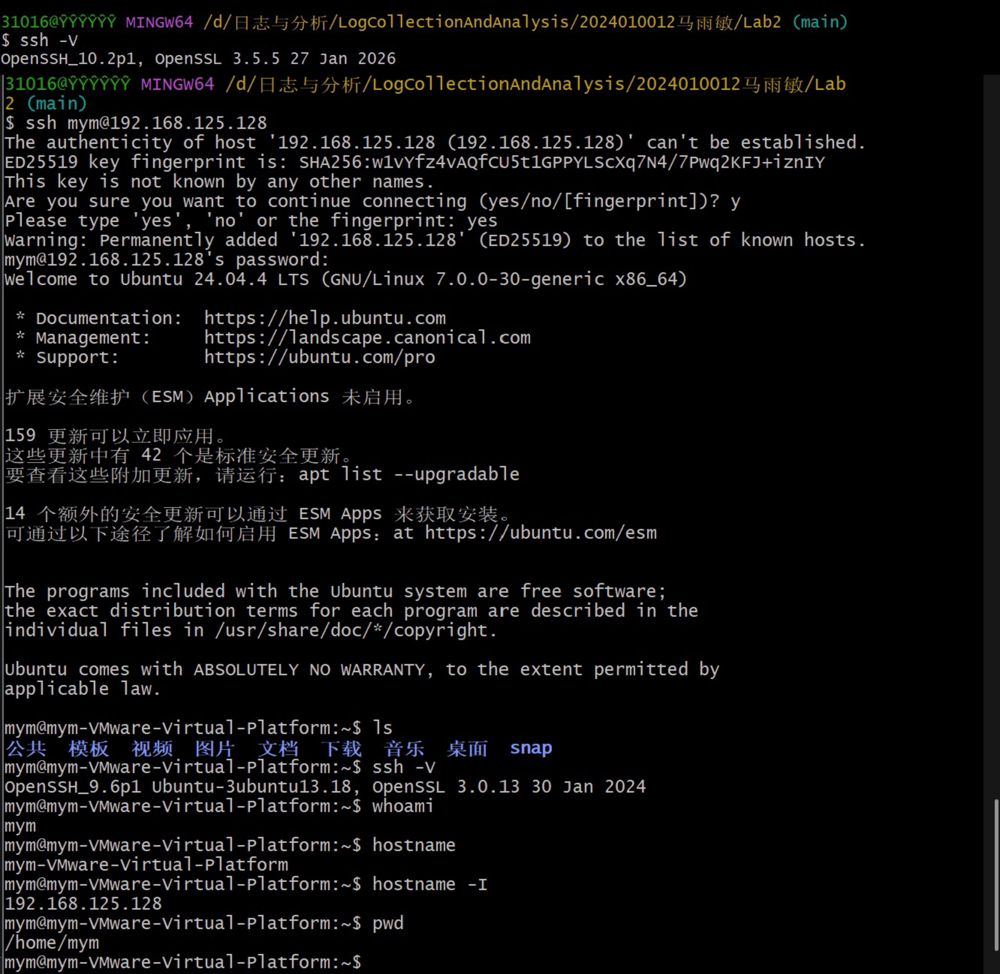
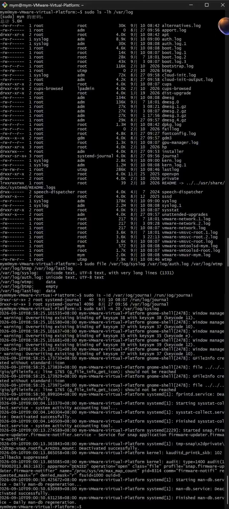
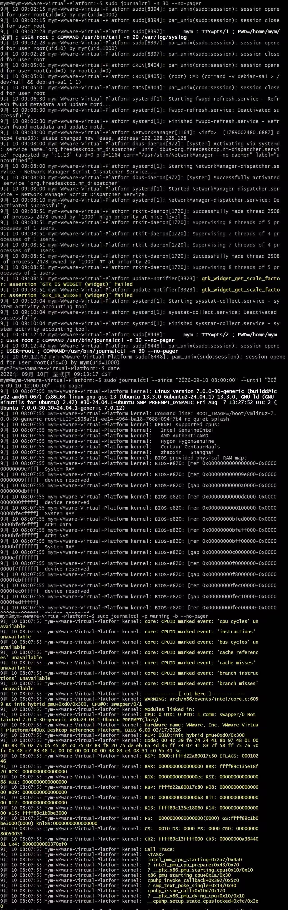

# Lab2：Linux 日志认识与查询

本实验承接 [Lab1 操作手册](../Lab1/操作手册.md) 和 [Lab1 验收作业](../Lab1/Lab1.md)。开始前应已完成 VMware、Ubuntu、网络、虚拟硬件、VMware Tools、SSH 和 rsyslog 的安装与验收。

---

## 一、为什么要读日志

Linux 系统通常不会用弹窗报告每一件事。服务启动失败、用户登录、软件安装、内核报错和定时任务执行等事件，大多写入日志。系统表面上可能只是“连不上”“打不开”或“变慢了”，真正能说明发生过什么的，往往是日志中的几行记录。

日志可以理解为系统和应用留下的“行车记录仪”：

- 排查故障时，它能说明错误从什么时候开始、由哪个组件报告；
- 进行安全审计时，它能说明谁登录过、谁执行过管理员命令、哪些访问被拒绝；
- 复盘事件时，它能把多个来源的记录按时间串成一条证据链。

> 查询时保留实际命令和原始输出。没有匹配结果也应如实说明，不要为了截图编造日志。

---

## 二、实验目标与完成顺序

将本文件复制到自己的“学号姓名”文件夹下，保存为 `Lab2/Lab2.md`，并在 `Lab2/` 中创建 `imgs/` 目录。**每完成一项，就在题目后的填写处记录结果，并保存该项截图。**

| 任务 | 完成内容 | 操作与填写位置 |
| :--- | :--- | :--- |
| 准备与连接 | 认识日志保存方式，检查环境，通过 Git Bash 登录 Ubuntu | 3.1 至 3.3 节 |
| 盘点日志 | 登记 5 个真实存在的日志文件或目录 | 3.4 节 |
| 练习查询 | 完成最近记录、时间范围和严重程度三类查询 | 3.5 节 |
| 简短总结 | 回答 1 道简答题 | 3.6 节 |

**必做成果：5 项日志盘点、3 类查询记录、1 道简答题、3 张截图。** 本实验不要求填写 4W1R 分析表。标为“选读”的内容不要求执行、填写或额外截图；工具缺失时也不要求为选读任务补装软件。

遇到问题时查阅第五节，完成后按第六、七节核对文件和截止时间。

---

## 三、日志认识与查询任务

本次目标是能登录 Ubuntu、找到日志，并用条件筛选需要的记录。按 3.1 至 3.6 节完成即可。

### 3.1 认识日志的保存方式

先弄清两个问题：谁在保存日志，到哪里读取日志。

#### 谁保存日志：journald 与 rsyslog

Ubuntu 24.04 中，本实验主要接触两套日志服务。`systemd-journald` 是 systemd 自带的日志服务，后文简称 **journald**；`rsyslog` 接收 syslog 消息，并按规则把消息写入不同的文本文件。

| 对比项 | systemd-journald | rsyslog |
| :--- | :--- | :--- |
| 主要工作 | 收集内核、系统服务和程序的消息，并附带服务、进程、启动周期等信息 | 按消息类别和级别分流，写入相应文件 |
| 保存形式 | 二进制 journal | 本实验使用的 `syslog`、`auth.log`、`kern.log` 等文本文件 |
| 查看工具 | `journalctl` | `tail`、`less`、`grep` 等文本工具 |

在本课程环境中，常见的数据流可以这样理解：

```text
系统、服务、程序的消息
          │
          ▼
systemd-journald ──> 二进制 journal ──> journalctl 查询
          │
          └── 部分 syslog 消息 ──> rsyslog ──> 文本日志 ──> tail / less / grep
```

因此，同一条消息可能既能用 `journalctl` 查到，也能在 `/var/log/syslog` 中找到。journald 收到的消息更广，并非每条 journal 记录都会进入 rsyslog 文本文件。

`dpkg`、`apt`、`nginx` 等应用还会直接写自己的日志文件。看到某个文件位于 `/var/log/`，不能就认定它一定由 rsyslog 写入。

#### 到哪里找：日志位置与读取工具

先区分保存形式：**文本日志可以直接按行查看；二进制日志要由专用工具解码；日志目录中还需要找到具体文件，或交给相应工具查询。** 下表用于查阅，不要求逐项读取或分析。本实验只需完成下面列出的必做任务。

| 日志入口 | 主要内容 | 类型 | 正确读取方式 |
| :--- | :--- | :--- | :--- |
| `/var/log/syslog` | 系统与服务的综合 syslog 消息 | 文本 | `sudo tail`、`sudo grep` |
| `/var/log/auth.log` | SSH、sudo、登录认证与授权事件 | 文本 | `sudo tail`、`sudo grep` |
| `/var/log/kern.log` | 内核、驱动、硬件和 OOM 等消息 | 文本 | `sudo tail`；也可用 `journalctl -k` |
| `/var/log/dpkg.log` | 软件包安装、升级、删除和状态变化 | 文本 | `sudo tail`、`sudo grep` |
| `/var/log/apt/history.log` | apt 操作的时间、命令和软件包清单 | 文本 | `sudo less`、`sudo tail` |
| `/var/log/apt/term.log` | apt 安装过程中的终端输出 | 文本 | `sudo less`、`sudo tail` |
| `/var/log/journal/` 或 `/run/log/journal/` | systemd journal 数据 | 二进制日志目录 | `journalctl`，不能直接 `cat` |
| `/var/log/wtmp` | 登录成功、注销和重启历史 | 二进制 | `last`；找不到命令时按表格下方说明处理 |
| `/var/log/btmp` | 登录失败历史 | 二进制 | `sudo lastb` |
| `/var/log/lastlog` | 每个账号最近一次登录 | 二进制 | `lastlog` |
| `/var/log/nginx/` | nginx 访问与错误日志 | 文本目录 | `sudo tail`、`sudo less`；未安装时通常不存在 |

**`last` 未安装或提示“找不到命令”时**

以下命令在 **Ubuntu 终端，或已通过 SSH 登录 Ubuntu 的窗口**中逐条执行。先检查工具是否可用：

```bash
command -v last
```

有路径输出（例如 `/usr/bin/last`）表示工具已可用，无需安装。没有输出，或运行 `last` 时提示 `command not found`，再按下面的方法处理。

本课程使用 **Ubuntu 24.04 LTS**，其中 `last` 和 `lastb` 由 **`util-linux`** 软件包提供。需要补装时，先刷新软件包索引：

```bash
sudo apt update
```

刷新成功后，补装或修复工具：

```bash
sudo apt install --reinstall util-linux
```

`--reinstall` 可恢复“软件包已经安装，但命令文件缺失”的情况。完成后再试读：

```bash
last -n 5
```

如果命令能运行，但提示 `/var/log/wtmp` 不存在或没有登录条目，说明问题在于数据库或记录，不必继续安装工具。登录历史属于选读，工具缺失时也可以直接跳过，不影响本次必做任务。其他 Ubuntu 版本的软件包归属可能不同，不要直接套用上述包名。

journal 也可能保存在 `/run/log/journal/`。`/run` 中的记录重启后可能消失，`/var/log/journal/` 用于持久保存；两个位置都使用 `journalctl` 查询。

表格左列是**存储位置**，右列是**读取工具**。例如 `/var/log/wtmp` 是文件，`last` 是读取它的命令；`journalctl -k` 读取 journal 中的内核消息，本身不是另一个日志文件。

机器上不一定具备表中所有文件和工具。实验时应按实际输出记录情况；文本日志的权限、登录历史工具缺失等问题在后面的操作步骤和排错部分处理。

### 3.2 检查日志服务与时间

执行位置：**Ubuntu 虚拟机终端**。每条命令执行后看清输出，随即填写该项记录。

**检查 journald 服务**

```bash
systemctl is-active systemd-journald
```

`systemctl` 用于管理 systemd 服务，`is-active` 查询运行状态。期望输出 `active`，表示 journald 正在运行。

> 记录：journald 的实际运行状态为 ___active___。

**检查 rsyslog 服务**

```bash
systemctl is-active rsyslog
```

期望输出 `active`。SSH 服务和端口会在 3.3 节检查。

> 记录：rsyslog 的实际运行状态为 ____active__。

**检查系统时间**

```bash
timedatectl
```

查看本地时间、时区和时间同步状态。日期与时间应正确，时区应为 `Asia/Shanghai`；时间错误会影响后面的日志筛选。

> 记录：Ubuntu 的日期和时间为 ____2026-09-10 08:36:04 CST__；时区为 ___Asis/Shanghai___；时间同步状态为 ____yes__。

**检查 syslog 文件**

```bash
sudo test -f /var/log/syslog && echo "syslog exists"
```

期望看到 `syslog exists`。`test -f` 判断路径是否为普通文件；`&&` 表示判断成功后才执行右边的 `echo`。

> 记录：`/var/log/syslog` 是否存在？_____是__；实际输出：____syslog exists__。

**检查认证日志文件**

```bash
sudo test -f /var/log/auth.log && echo "auth.log exists"
```

期望看到 `auth.log exists`。这里的 `sudo` 用于取得检查系统日志所需的权限。

> 记录：`/var/log/auth.log` 是否存在？_____是_；实际输出：_____auth.log exists_。

如果服务未运行、时间错误，或文件检查没有预期输出，先按 [Lab1 操作手册](../Lab1/操作手册.md#九安装课程必需组件)修复。`syslog` 和 `auth.log` 是本实验的必需环境，检查通过后继续 3.3 节。

### 3.3 从 Git Bash 通过 SSH 登录 Ubuntu

#### 先分清连接方向

Windows 宿主机上的 Git Bash 是 **SSH 客户端**，Ubuntu 虚拟机是 **SSH 服务端**。

```text
Windows 的 Git Bash ──SSH 连接──> VMware 中的 Ubuntu
```

发起连接时，在 Windows Git Bash 中输入命令，用户名和目标 IP 填 Ubuntu 的信息。登录成功后，这个窗口中执行的命令就在 Ubuntu 上运行；输入 `exit` 后才回到 Windows。

#### 常见工具：Xshell、Xftp 与 MobaXterm（选读）

Windows 上还有一些常用的连接与文件传输工具。先分清两项操作：**远程终端用于登录 Ubuntu 并执行命令；文件传输用于在 Windows 和 Ubuntu 之间上传、下载文件。**

| 工具 | 主要用途 | 使用示例 |
| :--- | :--- | :--- |
| Xshell | 远程终端工具，可通过 SSH 登录 Ubuntu | 连接后执行 `whoami`、`journalctl` 等命令，查看系统和日志 |
| Xftp | 文件传输工具，支持 SFTP 和 FTP；连接本课程的 Ubuntu 时使用 SFTP | 把 Windows 中的文件上传到 Ubuntu，或把 Ubuntu 中的文件下载到 Windows |
| MobaXterm | 集成 SSH 终端和 SFTP 文件浏览器 | 在终端中执行命令，同时通过侧边文件浏览器上传、下载文件 |

Xshell 与 Xftp 可以搭配使用，分别负责执行命令和传文件；MobaXterm 将这两项功能放在同一个应用中。这些工具运行在 Windows 上，远程登录后执行的命令仍在 Ubuntu 上运行。

通过 SSH 登录或使用 SFTP 传文件时，本课程都使用 **Ubuntu 的 IP、端口 `22`、Ubuntu 用户名和密码**。SFTP 通过 SSH 服务传输文件，Ubuntu 已启用 SSH 时通常即可使用。

需要了解软件时，可查看官方网站：[Xshell](https://www.netsarang.com/en/xshell/)、[Xftp](https://www.netsarang.com/en/xftp/)、[MobaXterm](https://mobaxterm.mobatek.net/)。本段供了解，**本次操作和截图仍按下面的 Git Bash 步骤完成**。

#### 在 Ubuntu 中取得连接信息

以下四条命令都在 **Ubuntu 虚拟机终端**中执行，一条一条输入并查看输出。

**第 1 条：查看 Ubuntu 用户名**

```bash
whoami
```

`whoami` 显示当前登录用户名。例如输出 `student`，后面 SSH 命令中 `@` 左边就填写 `student`。

> 记录：Ubuntu 用户名为 ____mym_。

**第 2 条：查看 Ubuntu 虚拟机 IP**

```bash
hostname -I
```

这里的 `-I` 是大写字母 `I`，不是小写 `i`，也不是数字 `1`。输出可能包含多个地址，应选择与 VMware NAT 网段对应的私有 IPv4 地址，例如 `192.168.80.128`，不要填写 `127.0.0.1`。把这个地址记下来，后面填写在 SSH 命令的 `@` 右边。

> 记录：本次 SSH 连接使用的 Ubuntu 虚拟机 IP 为 ____192.168.125.128__。

**第 3 条：确认 SSH 服务正在运行**

```bash
systemctl is-active ssh
```

期望输出 `active`，表示 SSH 服务当前正在运行。若输出其他状态，先按 Lab1 操作手册修复 SSH 服务。

> 记录：SSH 服务的实际运行状态为 ____active__。

**第 4 条：确认 22 端口正在监听**

```bash
ss -lnt | grep ':22 '
```

`ss -lnt` 查看正在监听的 TCP 端口：`-l` 只看监听端口，`-n` 用数字显示地址和端口，`-t` 只看 TCP。管道符 `|` 把输出交给 `grep`，只保留包含 `:22 ` 的行；引号内末尾的空格用于避免误匹配 2200 等端口。

期望看到包含 `LISTEN` 和 `:22` 的记录，例如本地地址为 `0.0.0.0:22` 或 `[::]:22`。如果没有输出，说明这条查询没有找到 22 端口监听记录，应先排查 SSH 服务再连接。

> 记录：22 端口是否正在监听？___是___；输出中的本地地址和端口为 ____0.0.0.0.：22 ,[::]:22____。

#### 在 Windows 中连接并确认登录成功

**打开 Git Bash，检查 SSH 客户端**

在 Windows 开始菜单中打开 Git Bash，然后执行：

```bash
ssh -V
```

`-V` 是大写字母，输出应包含 OpenSSH 版本号。找不到命令时按 5.1 节处理。

**发起连接**

把下面的 `student` 和 `192.168.80.128` 换成上面记录的 Ubuntu 用户名和 IP，再执行：

```bash
ssh student@192.168.80.128
```

`@` 左边是用户名，右边是目标地址。本实验使用默认 TCP 22 端口和密码认证。

**按提示确认主机并输入密码**

首次连接可能出现：

```text
Are you sure you want to continue connecting (yes/no/[fingerprint])?
```

输入完整的 `yes` 并按回车。出现 `password:` 时输入 Ubuntu 用户密码；屏幕不会显示字符或星号，输入完成后按回车即可。

**登录后确认当前用户和主机**

先查看用户名：

```bash
whoami
```

输出应是 Ubuntu 用户名。

> 记录：SSH 登录后的用户名为 ___mym___。

再查看主机名：

```bash
hostname
```

输出应是 Ubuntu 主机名。

> 记录：SSH 登录后的主机名为 ____mym-VMware-Virtual-Platform__。

最后查看当前目录：

```bash
pwd
```

输出通常是该用户在 Ubuntu 中的主目录，例如 `/home/student`。

> 记录：当前目录为 ____/home/mym__；是否确认已通过 Git Bash 登录 Ubuntu？____是__。

**退出前保存 `imgs/lab2_ssh_login.png`**，保留 SSH 连接命令及这三条验证命令的输出，图片在下方显示。保存后可以继续使用这个 SSH 会话完成 3.4、3.5 节。



### 3.4 盘点 5 项日志并试读

以下操作在已登录 Ubuntu 的 SSH 会话中执行，也可以使用 Ubuntu 虚拟机终端。

先查看目录内容：

```bash
sudo ls -lh /var/log
```

这条命令以长格式列出 `/var/log` 目录中的内容，并把文件大小换算成便于阅读的单位。第一次使用时应能说清每一部分：

| 命令部分 | 含义 |
| :--- | :--- |
| `sudo` | 以管理员权限执行，避免因部分日志目录权限受限而漏掉信息 |
| `ls` | 列出目录内容；不加路径时默认列出当前目录 |
| `-l` | 使用长格式，依次显示类型与权限、链接数、所有者、所属组、大小、修改时间和名称 |
| `-h` | `--human-readable` 的简写，把大小显示成 `K`、`M`、`G` 等单位；通常与 `-l` 搭配使用 |
| `/var/log` | 本次要盘点的目标目录 |

用 `file` 观察文本日志和二进制登录数据库的差别：

```bash
sudo file /var/log/syslog /var/log/auth.log /var/log/wtmp /var/log/btmp /var/log/lastlog
```

`file` 不依赖文件扩展名，而是检查文件内容特征并判断类型。这里一次传入五个路径进行对比：`syslog`、`auth.log` 通常识别为文本，`wtmp`、`btmp`、`lastlog` 通常识别为数据文件。`sudo` 用于保证能够读取权限受限的文件头。如果显示 `empty`，表示文件存在但没有内容；如果提示 `No such file or directory`，表示对应路径不存在，可在盘点表中改选其他真实路径。

再查看 journal 的两个常见目录：

```bash
sudo ls -ld /var/log/journal /run/log/journal
```

`ls -d` 列出目录本身。保留实际存在的路径；某个路径提示 `No such file or directory` 时，表示该目录不存在。目录中是否有可读 journal 记录，会在 3.5 节继续确认。

> 记录：`/var/log/journal/` 的检查结果为 ___drwxr-sr-x+ 2 root systemd-journal 4096  9月 10 08:07 /var/log/journal___；`/run/log/journal/` 的检查结果为 ____drwxrwxr-x  3 root systemd-journal 4096  9月 10 07:56 /run/log/journal__。

**在此填写日志盘点表**：根据刚才的目录和类型检查，登记 **5 个真实存在的日志文件或目录** 即可。不存在的路径不计入这 5 项；命令名也不能当作文件路径。可从 3.1 节查阅用途和读取工具，也可选用其他真实日志。

| 实际路径 | 主要用途 | 文本、二进制还是目录 | 使用什么命令读取 |
| :--- | :--- | :--- | :--- |
| /var/log/syslog|系统全局综合日志，记录内核及系统服务、程序的通用运行消息 |文本 | sudo tail -n 20 /var/log/syslog|
|/var/log/auth.log | 用户认证与授权日志，记录登录、su/sudo、ssh 等鉴权事件|文本 |sudo grep sshd /var/log/auth.log |
|/var/log/wtmp |所有用户的登录 / 登出历史记录 |二进制 |last |
| /var/log/lastlog| 每个用户最近一次登录时间记录|二进制 |lastlog |
|/var/log/journal |systemd-journald 持久化日志存储目录 | 目录|journalctl |

**先读取文本日志**

以 `syslog` 为例，查看最后 20 行：

```bash
sudo tail -n 20 /var/log/syslog
```

`tail` 读取文件末尾，`-n 20` 指定 20 行。`sudo` 用于读取权限受限的日志；本实验使用 `sudo` 即可，无需修改日志文件权限。

登录历史工具的试读方法放在第四节，属于选读；本题不要求补装工具或逐项检查登录数据库。

保存 `imgs/lab2_log_inventory.png`，保留目录盘点和 `file` 的关键输出。个别路径不存在时，可在盘点表中选择其他实际存在的路径。



#### 文件查看命令补充（选读）

`ls` 还常用 `-a`（包括以 `.` 开头的隐藏项）、`-t`（按修改时间排序）、`-r`（反转排序结果）和 `-d`（列出目录本身，而不是展开目录内容）。选项可以合并，例如 `ls -lah /var/log` 等价于 `ls -l -a -h /var/log`。本实验只需执行题目给出的命令，不要为了让目录更易读而删除、移动或改名其中的日志。

按需要选择以下文本工具：

| 用法 | 作用 |
| :--- | :--- |
| `tail -f 文件` | 实时查看追加的新行，按 `Ctrl + C` 退出 |
| `less 文件` | 分页阅读；按 `G` 到末尾，输入 `/关键词` 搜索，按 `n` 找下一处，按 `q` 退出 |
| `grep -i "关键词" 文件` | 查找包含关键词的行，`-i` 表示忽略英文字母大小写 |
| `grep -n "关键词" 文件` | 查找时同时显示行号 |
| `grep -F "原样文本" 文件` | 按普通字符串查找，不解释正则符号 |
| `grep -v "关键词" 文件` | 排除包含关键词的行 |

`last` 和 `lastb` 常见参数基本相同：`-n 数量` 限制条数，`-F` 显示完整登录和退出时间，`-i` 尽量以数字 IP 显示远端地址，`-x` 同时显示关机、重启和运行级别变化。例如 `last -F -n 10` 可以显示更完整的登录时间。

### 3.5 完成三类 journalctl 查询

本节完成下面三类查询，各记录一句观察。命令一条一条执行：`sudo` 用于读取系统日志，`--no-pager` 表示直接输出。

**查询一：最近 30 条日志**

```bash
sudo journalctl -n 30 --no-pager
```

`-n 30` 只显示最新的 30 条记录。默认按时间从旧到新排列，可以看到不同程序或服务的消息；这里只需任选一条阅读，不用逐条分析。

> 记录：选取的一条日志来自哪个程序或服务？____systemd__；记录了什么事件？____wupd‑refresh.service 服务启动并完成刷新元数据操作。__。

**查询二：指定时间范围**

先查看 Ubuntu 当前时间，用它确定包含本次实验的查询区间：

```bash
date
```

把下面的起止时间换成实验当天的真实范围，再执行：

```bash
sudo journalctl --since "2026-09-09 08:00:00" --until "2026-09-09 12:00:00" --no-pager
```

`--since` 指定起点，`--until` 指定终点，日期时间中的空格要保留在引号内。例如本次操作发生在 09:20，可以查询当天 09:00 至 09:30。若无结果，先核对时间范围和时区。

> 记录：实际查询起点为 ____2026‑09‑10 08:00:00__；终点为 ___ 2026‑09‑10 12:00:00___；观察到的事件或无记录情况为 ___输出大量内核启动、硬件识别、虚拟机硬件相关日志。

**查询三：按严重程度筛选**

```bash
sudo journalctl -p warning -b --no-pager
```

`-p warning` 选择 warning 及更严重的记录，`-b` 限定本次启动。它按日志级别筛选，不是搜索正文中的单词 `warning`。没有匹配结果属于正常情况，无需为了截图制造报错。

日志级别从严重到轻微依次为 `emerg`、`alert`、`crit`、`err`、`warning`、`notice`、`info`、`debug`。

> 记录：是否查到匹配日志？___是___；其中一条的内容或无记录提示为 ___kernel: core: CPUID marked event: 'cpu cycles' unavailable_。

保存 `imgs/lab2_journal_queries.png`，只需覆盖以上 **3 类查询**的命令和关键输出。可合理拼图，长输出保留代表性记录，无匹配记录时保留真实提示。



#### 启动周期与内核查询（选读，无需填写或截图）

**查看启动周期**

先列出 journal 已保存的启动周期：

```bash
sudo journalctl --list-boots --no-pager
```

再查看本次启动的最后 30 条记录：

```bash
sudo journalctl -b -n 30 --no-pager
```

只有启动周期列表中存在 `-1` 时，才执行下面的上次启动查询；否则跳过：

```bash
sudo journalctl -b -1 -n 30 --no-pager
```

`--list-boots` 的每一行通常包含三部分：相对编号、Boot ID，以及该次启动日志的起止时间。例如：

```text
 -1 0123456789abcdef0123456789abcdef Thu 2026-09-03 08:10:20 CST—Thu 2026-09-03 10:35:42 CST
  0 fedcba9876543210fedcba9876543210 Fri 2026-09-04 07:55:01 CST—Fri 2026-09-04 09:20:18 CST
```

| 输出或参数 | 含义 |
| :--- | :--- |
| `0`、`-b`、`-b 0` | 当前这一次启动；单独写 `-b` 等价于 `-b 0` |
| `-1`、`-b -1` | 上一次启动；`-2` 表示上上次，以此类推 |
| 32 位 Boot ID | systemd 为一次启动生成的唯一标识；也可以把它交给 `-b` 精确查询 |
| 起止时间 | 该启动周期在 journal 中保存的第一条和最后一条记录时间，不一定等于机器实际开关机的完整时间 |

注意，编号是相对于当前启动计算的，不是永久编号。如果列表只有 `0`，就没有可供 `-b -1` 查询的上次启动日志。常见原因是虚拟机尚未重启过，或 journal 使用易失存储，重启后旧记录没有保留。

**查看本次启动的内核日志**

```bash
sudo journalctl -k -b -n 30 --no-pager
```

这条命令按“来源 + 启动周期 + 数量”筛选：`-k` 只看内核消息，`-b` 只看本次启动，`-n 30` 再取最后 30 条。内核日志常见内容包括硬件识别、驱动加载、网卡状态、磁盘和内存信息；一条状态消息不一定表示故障。

#### journalctl 参数速查（选读）

需要其他筛选方式时查阅，无需逐项执行。

| 参数 | 完整写法或作用 | 常见用途 |
| :--- | :--- | :--- |
| `-n 数量` | `--lines=数量` | 只看最后若干条，防止输出过多 |
| `-r` | `--reverse` | 倒序显示，最新记录在前 |
| `-f` | `--follow` | 实时跟踪新日志，按 `Ctrl + C` 退出 |
| `-e` | `--pager-end` | 进入分页器并直接跳到日志末尾 |
| `-u 单元名` | `--unit=单元名` | 按 systemd 服务筛选，如 `ssh`、`rsyslog` |
| `-t 标签` | `--identifier=标签` | 按 syslog 标签筛选 |
| `-k` | `--dmesg` | 只看内核日志 |
| `-b` | `--boot` | 本次启动；`-b -1` 表示上一次启动 |
| `--list-boots` | 列出已保存的启动周期 | 先确认有哪些 boot 可以查询 |
| `--since 时间` | 设置起始时间 | 支持 `today`、完整日期和 `30 minutes ago` 等写法 |
| `--until 时间` | 设置结束时间 | 与 `--since` 组合查询一个时间段 |
| `-p 级别` | `--priority=级别` | 查看该级别及更严重的记录，如 `warning`、`err` |
| `-g 正则` | `--grep=正则` | 按消息正文匹配正则表达式 |
| `-o 格式` | `--output=格式` | 改变输出格式，如 `short-iso`、`verbose`、`json-pretty` |
| `--no-pager` | 禁用分页器 | 直接输出，适合截图、重定向和管道处理 |
| `--disk-usage` | 显示 journal 占用空间 | 检查日志存储量，不读取具体日志内容 |

### 3.6 实验小结

**简答题：** 为什么不能直接用 `cat` 读取 `/var/log/wtmp` 和 `/var/log/btmp`？应分别使用什么命令？用一至三句话回答，无需额外执行登录历史工具。

> 填写：`/var/log/wtmp` 和 `/var/log/btmp` 属于**二进制日志文件**，cat 只能读取文本文件，直接查看会显示乱码。读取`/var/log/wtmp`使用`last`命令；读取`/var/log/btmp`使用`lastb`命令。

**完成要求：** 环境与登录结果已填写；盘点表有 5 个真实路径；三类查询各有一句观察；本题已回答。完成后按第六节核对文件，单独提交 Lab2 的 PR。

---

## 四、登录历史读取参考（选读）

以下内容供需要时查阅，无需填写分析表或额外截图。命令缺失、数据库不存在或没有记录时均可跳过。

### 4.1 登录历史：last、lastb、lastlog

这部分只演示二进制登录数据库的读法。命令缺失或没有记录时可以直接跳过；`last` 的补装方法已放在 3.1 节首次介绍该命令的位置，其他情况见下方说明，无需为此补写分析。

**先逐条检查工具是否可用**

```bash
command -v last
```

```bash
command -v lastb
```

```bash
command -v lastlog
```

`command -v` 输出工具路径时，可以执行对应的读取命令；没有输出时跳过该工具。

**成功登录、注销和重启历史**

```bash
last -n 5
```

`last` 读取 `/var/log/wtmp`，`-n 5` 最多显示 5 条；增加 `-F` 可显示更完整的时间。

**格式示例：一次登录会话**

`last` 把二进制登录记录转成可读文字。例如：

```text
student  pts/0  192.168.80.1  Tue Sep 8 10:00  still logged in
```

这行依次是“账号、终端会话、来源地址、登录时间、会话状态”。`pts/0` 是终端会话名称，`still logged in` 表示查询时该记录显示会话仍未退出。

**这条记录的含义**：账号 student 从 192.168.80.1 登录了本机的 pts/0 终端会话，登录时间为 9 月 8 日 10:00，查询时记录显示仍未退出。这条记录没有说明使用的是密码认证还是密钥认证。

**失败登录历史**

```bash
sudo lastb -n 5
```

`lastb` 读取 `/var/log/btmp`，通常需要管理员权限。它显示失败登录的账号、来源和时间；具体原因未记录时不能猜测。

**各账号最近一次登录**

```bash
lastlog | head -n 10
```

`lastlog` 读取 `/var/log/lastlog`，这里先看前 10 行。需要查看本人时，把 `student` 换成 Ubuntu 用户名：

```bash
lastlog -u student
```

`Never logged in` 表示该数据库没有保存此账号的最近登录记录，不能据此断言账号从未登录过。SSH 认证日志可以提供登录事件证据，但不等于解码这些数据库，也不是完整登录历史。

### 4.2 工具缺失或没有记录时的处理方法（选读）

`last`、`lastb`、`lastlog` 的读取练习属于选读。**遇到以下情况均可跳过，不影响本次必做任务，也不要求补写分析。** 希望继续探索时，再使用下面的方法排查。

| 实际现象 | 含义 |
| :--- | :--- |
| `command not found`，或 `command -v` 无输出 | 当前环境找不到读取工具 |
| 工具提示对应文件 `No such file or directory` | 数据库文件不存在 |
| 工具能运行，但只有表头等，没有登录条目 | 当前数据库没有可显示的记录 |
| `lastlog` 显示 `Never logged in` | 数据库没有保存该账号的最近登录记录，不能据此断言从未登录 |

**`lastlog` 缺失时的补装方法**

`last` 或 `lastb` 缺失时使用 3.1 节的 `util-linux` 补装方法。若缺少的是 `lastlog`，先在 Ubuntu 终端或已登录 Ubuntu 的 SSH 会话中确认版本：

```bash
cat /etc/os-release
```

在 **Ubuntu 24.04 LTS** 中，`lastlog` 由 `login` 软件包提供。确认 `PRETTY_NAME` 为 Ubuntu 24.04.x LTS，并且希望恢复该工具后，先刷新索引：

```bash
sudo apt update
```

刷新成功后，再补装或修复软件包：

```bash
sudo apt install --reinstall login
```

`--reinstall` 可恢复已安装软件包中缺失的命令文件。完成后，重新执行上面的 `command -v lastlog` 检查。

其他 Ubuntu 版本的软件包归属和登录存储方式可能不同，不要直接套用这组包名。工具已可用但没有记录时，重新安装工具也不会补出历史数据。

`auth.log` 和 SSH journal 能提供登录事件证据，但不是对 `wtmp`、`btmp`、`lastlog` 的解码结果。数据库没有可显示的记录时可以跳过，不必反复尝试登录来补齐记录。

---

## 五、常见问题与排错

### 5.1 SSH 连接问题

| Git Bash 提示 | 通常表示 | 优先检查 |
| :--- | :--- | :--- |
| `Connection refused` | 连接被拒绝，常见原因是目标端口没有服务监听 | `systemctl is-active ssh`、`ss -lnt` |
| `Connection timed out` | 连接等待超时，可能存在网络或防火墙问题 | IP 是否变化、VMware 网卡是否连接、网络模式是否为 NAT |
| `Permission denied` | 网络与 SSH 服务正常，但认证未通过 | Ubuntu 用户名、密码和键盘输入法 |
| `Could not resolve hostname` | 把示例文字或错误主机名当成了目标 | 直接使用 `hostname -I` 得到的 IPv4 地址 |
| Git Bash 中找不到 `ssh` | Git for Windows 安装不完整 | 重新安装 Git for Windows，并启用其 OpenSSH 组件 |

**在 Windows Git Bash 中检查客户端**

需要查看更多客户端诊断信息时，先替换为自己的用户名和虚拟机 IP，再执行：

```bash
ssh -v student@192.168.80.128
```

**SSH 参数参考（按需查看）**

| 参数 | 作用 | 示例 |
| :--- | :--- | :--- |
| `-p 端口` | 连接非默认端口；注意这里是小写 `-p` | `ssh -p 2222 student@192.168.80.128` |
| `-v` | 显示一次连接的调试过程；`-vv`、`-vvv` 会更详细 | `ssh -v student@192.168.80.128` |
| `-i 私钥路径` | 指定登录使用的私钥文件 | `ssh -i ~/.ssh/id_ed25519 student@192.168.80.128` |
| `-T` | 不分配伪终端，常用于测试认证或自动化 | `ssh -T student@192.168.80.128` |

本实验的必做连接使用 3.3 节的默认端口和密码认证；上表供理解参数或排错时参考。

**在 Ubuntu 虚拟机终端检查服务端**

连接尚未成功时，打开 VMware 中的 Ubuntu 终端检查服务和端口。`ss` 的常见参数还有 `-u`（UDP）、`-p`（显示关联进程，通常需要 `sudo`）和 `-a`（显示监听与非监听套接字）。例如 `sudo ss -lntp` 可以同时查看 TCP 监听端口和占用端口的进程。

`systemctl status ssh --no-pager` 可进一步查看服务状态、进程和最近几条日志；`is-active` 只回答当前是否运行，`is-enabled` 则回答是否设为开机启动。

### 5.2 日志查询与环境问题

| 现象 | 原因 | 处理方法 |
| :--- | :--- | :--- |
| 读取 `auth.log` 或 `syslog` 提示 `Permission denied` | 普通用户没有日志文件读取权限 | 在查看命令前加 `sudo`；不要随意修改系统日志权限 |
| `/var/log/syslog` 或 `/var/log/auth.log` 不存在 | rsyslog 未正常运行，或 Lab1 环境未完成 | 回到 Lab1 操作手册修复并重新验收 |
| `journalctl -b -1` 为空 | 只有一个可用启动周期，或 journal 未持久化 | 先看 `journalctl --list-boots`；没有上次记录时跳过该选读项 |
| 日志时间与北京时间不一致 | 时区或系统时间错误 | 用 `timedatectl` 检查；按 Lab1 环境说明修复后重新查询 |

---

