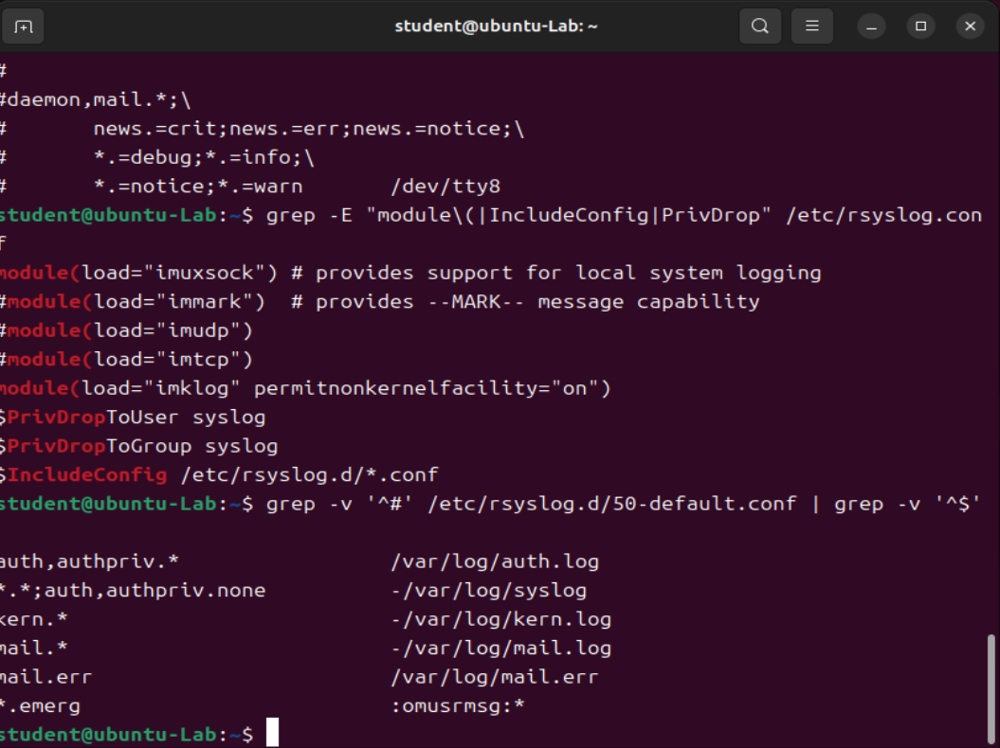
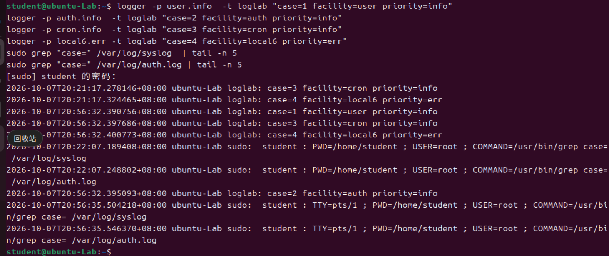
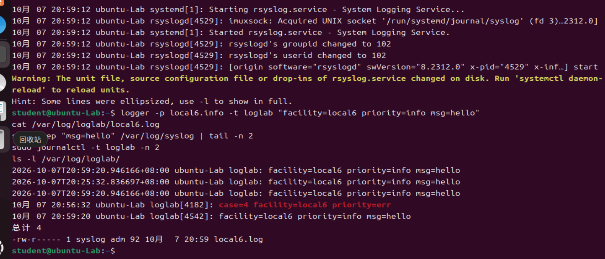
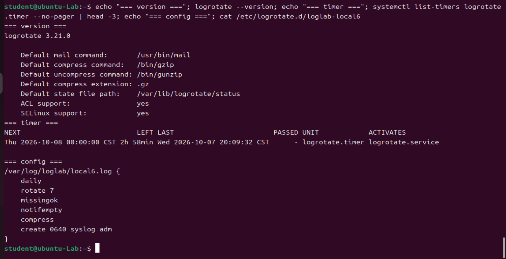
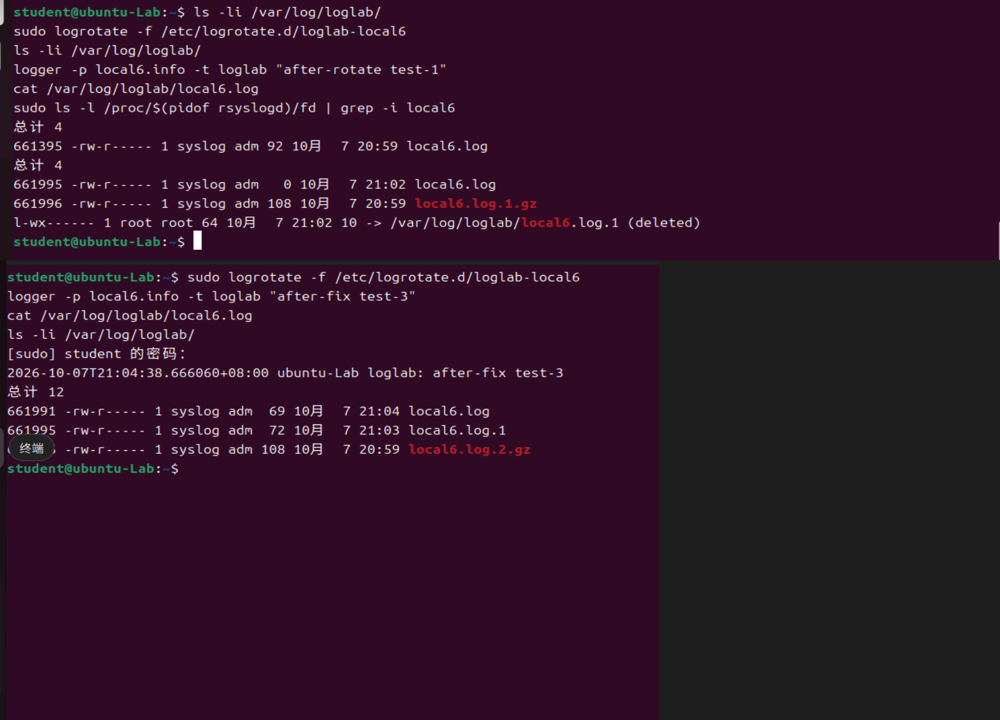

# Lab4：Linux 日志分流与轮转

> 本实验承接 Lab1/Lab2/Lab3，在同一台 Ubuntu 虚拟机上完成：为 `local6` 设施新增一条日志分流规则，并为新日志配置 logrotate 轮转策略，最后复现并修复一次轮转事故。

## 作业信息

| 项目 | 填写内容 |
| :--- | :--- |
| 学号 | 2024010015 |
| 姓名 | 胡再冉 |
| 班级 | 24信息安全 |
| 完成日期 | 2026.10.7 |

---

## 二、日志的两个"隐藏标签"：facility 与 priority

每条 syslog 消息除了正文，还随身携带两个标签，rsyslog 的分流规则就是拿它们做判断：

| 标签 | 回答的问题 | 取值范围 |
| :--- | :--- | :--- |
| **facility**（设施） | 这条日志是哪一类？ | 24 个编号 0～23，常用：`kern`(0)、`user`(1)、`auth`(4)、`syslog`(5)、`cron`(9)、`authpriv`(10)、`local0~local7`(16~23) |
| **priority**（级别） | 这条日志有多严重？ | 8 级，数字越小越严重：`emerg`(0)~`debug`(7) |

`logger` 不写 `-p` 时默认走 `user.notice`。

选择器写法要点（2.3 节）：
- `mail.err`：err 及更严重（err/crit/alert/emerg）；
- `mail.=err`：只有 err 这一级（多一个 `=` 表示精确匹配）；
- `mail.*`：mail 设施的全部级别；
- 逗号 `,` 表示"或者"（`auth,authpriv.*`）；
- 分号 `;` 后可排除（`*.*;auth,authpriv.none`，`none` 表示"这一类不要"）；
- 动作列 `-` 开头表示**异步写**（`-/var/log/xxx.log`）。

> 一条消息可以匹配多条规则，命中的规则都会执行，所以同一条日志同时出现在多个文件是正常现象。

---

## 三、任务 1：读懂系统默认的分流规则

rsyslog 配置分两层：主配置 `/etc/rsyslog.conf`（管进程怎么跑：加载模块、全局参数），碎片配置 `/etc/rsyslog.d/*.conf`（管日志怎么分，一条条"选择器+动作"）。两者接缝在主配置末尾的 `$IncludeConfig /etc/rsyslog.d/*.conf`。碎片配置按文件名前缀数字从小到大加载，**后读的规则不会覆盖前面的，而是追加**——一条消息可同时命中多条规则。

### 3.1 查看两个配置文件

```bash
less /etc/rsyslog.conf          # 主配置：加载模块、全局参数、末尾 $IncludeConfig
cat /etc/rsyslog.d/50-default.conf   # 碎片配置：一条条分流规则
```

> **记录**：`/etc/rsyslog.d/` 下除了 `50-default.conf`，还有哪些 `.conf` 文件？
>
> 答：还有 `20-ufw.conf`、`21-cloudinit.conf` 两个文件（`ls -la /etc/rsyslog.d/` 确认）。

### 3.2 默认规则解读

```text
auth,authpriv.*            /var/log/auth.log
*.*;auth,authpriv.none     -/var/log/syslog
kern.*                     -/var/log/kern.log
*.emerg                    :omusrmsg:*
```

> **自检题 ①**：Lab1 任务五的 `logger -t lab1-check "..."` 没写 `-p`，即默认的 `user.notice`。它为什么落在 `/var/log/syslog`，而不是 `auth.log`？
>
> 填写：因为默认 facility 是 `user`（编号 1），不是 `auth`/`authpriv`。规则 `auth,authpriv.*` 只匹配 auth 和 authpriv 两个设施，`user` 不命中，所以不会进 `auth.log`；而规则 `*.*;auth,authpriv.none` 命中所有设施，`user` 没有被任何 `none` 排除，所以被写进 `/var/log/syslog`。

> **自检题 ②**：sshd 的登录日志为什么**只**出现在 `auth.log`，不出现在 `syslog`？
>
> 填写：sshd 使用 `authpriv` 设施记录日志。规则 `auth,authpriv.*` 把 auth/authpriv 两个设施的全部级别单独写进 `auth.log`；同时 `*.*;auth,authpriv.none` 这一行用 `none` 明确排除了 auth 和 authpriv，所以它们不会重复落入 `/var/log/syslog`。因此 sshd 的登录记录只在 `auth.log`。



---

## 四、任务 2：facility/priority 打靶实验

发送四条不同 facility/priority 的消息，观察各自落点。

```bash
logger -p user.info  -t loglab "case=1 facility=user priority=info"
logger -p auth.info  -t loglab "case=2 facility=auth priority=info"
logger -p cron.info  -t loglab "case=3 facility=cron priority=info"
logger -p local6.err -t loglab "case=4 facility=local6 priority=err"
sudo grep "case=" /var/log/syslog  | tail -n 5
sudo grep "case=" /var/log/auth.log | tail -n 5
```

### 先猜（执行前根据规则判断）

| 命令 | 先猜：会落到哪个文件？ |
| :--- | :--- |
| case=1 `user.info` | `/var/log/syslog`（`user` 未被排除） |
| case=2 `auth.info` | `/var/log/auth.log`（`auth,authpriv.*` 命中；不进 syslog） |
| case=3 `cron.info` | `/var/log/syslog`（`cron` 未被排除） |
| case=4 `local6.err` | `/var/log/syslog`（`*.*` 命中）；暂无专属文件 |

### 实测观察表

| 命令 | 出现在 syslog？ | 出现在 auth.log？ | 用 2.3 节的规则解释原因 |
| :--- | :---: | :---: | :--- |
| case=1 `user.info` | 是 | 否 | `*.*;auth,authpriv.none` 命中 `user`，`user` 未被排除 → 写进 syslog |
| case=2 `auth.info` | 否 | 是 | `auth,authpriv.*` 命中 → auth.log；`*.*;auth,authpriv.none` 用 `none` 排除 auth → 不进 syslog |
| case=3 `cron.info` | 是 | 否 | `*.*` 命中 `cron`，未被排除 → 写进 syslog |
| case=4 `local6.err` | 是 | 否 | `*.*` 命中 `local6` → 写进 syslog；local6 暂无单独规则，无专属文件 |

**对照结论**：case2 只进 `auth.log`；case1、case3 只进 `syslog`；case4 也进 `syslog` 但没有专属文件——正是任务 3 要为它新建的那根管道。



---

## 五、任务 3：为 local6 增加日志文件

目标：让 local6 消息继续进 `syslog`，同时写入 `/var/log/loglab/local6.log`。

### 5.1 确认 rsyslogd 运行用户并建目录

```bash
ps -o user= -C rsyslogd
sudo mkdir -p /var/log/loglab
sudo chown syslog:adm /var/log/loglab
sudo chmod 0755 /var/log/loglab
```

> **记录**：rsyslogd 实际以哪个用户运行？
>
> 答：`syslog`（`ps -o user= -C rsyslogd` 输出 `syslog`，与 `/etc/rsyslog.conf` 中 `$PrivDropToUser syslog` 一致）。

> 铁律：写入文件的进程必须对目标目录具有相应写权限。若跳过 `chown`，rsyslog（以 `syslog` 身份）会在 `journalctl -u rsyslog` 里报 `Permission denied`。

### 5.2 写入规则文件

新建 `/etc/rsyslog.d/60-loglab-local6.conf`（`60-` 会在 `50-default.conf` 之后加载），内容仅一行：

```text
local6.*    /var/log/loglab/local6.log
```

### 5.3 检查语法并重启

```bash
sudo rsyslogd -N1                 # 期望最后一行 End of config validation run. Bye.
sudo systemctl restart rsyslog
systemctl status rsyslog --no-pager   # 期望 active (running)
```

### 5.4 发一条测试消息，三处验证

```bash
logger -p local6.info -t loglab "facility=local6 priority=info msg=hello"
cat /var/log/loglab/local6.log
sudo grep "msg=hello" /var/log/syslog | tail -n 2
sudo journalctl -t loglab -n 2
ls -l /var/log/loglab/
```

消息流向：`logger` → 本机 syslog 套接字 → 被 journald 和 rsyslogd 两个消费者同时看到。rsyslogd 再按规则匹配，`60-loglab-local6.conf` 的 `local6.*` 与 `50-default.conf` 的 `*.*` 两条规则各自命中 → 同一条消息在三处留下记录：

| 能看到它的地方 | 是谁记下的 | 为什么会有这一份 |
| :--- | :--- | :--- |
| `journalctl` | systemd-journald | journald 在套接字上先收下消息，写进二进制日志 |
| `/var/log/loglab/local6.log` | rsyslogd | 新写的 `60-loglab-local6.conf` 里 `local6.*` 命中 |
| `/var/log/syslog` | rsyslogd | `50-default.conf` 里 `*.*` 也命中，且未被 `none` 排除 |

> **记录**
>
> ① 新文件 `local6.log` 里能查到这条消息吗？
>
> 答：能，`cat /var/log/loglab/local6.log` 里能看到 `facility=local6 priority=info msg=hello`。
>
> ② `syslog` 里能查到吗？参照上面的流向图，说明同一条消息为什么三处都有记录。
>
> 答：能。同一条消息从套接字被 journald 与 rsyslogd 同时看到；rsyslogd 内部又被 `60-loglab-local6.conf` 的 `local6.*` 和 `50-default.conf` 的 `*.*` 两条独立规则各自命中，所以 journal、专属文件、syslog 三处都有记录。
>
> ③ `journalctl` 里能查到吗？
>
> 答：能，`sudo journalctl -t loglab -n 2` 里能看到 `msg=hello`。
>
> ④ 新文件的属主、属组和权限分别是什么？
>
> 答：属主 `syslog`、属组 `adm`、权限 `-rw-r-----`（0640），与 `/var/log/syslog` 一致。
>
> **截图 ①**：三处验证结果合图，保存为 `imgs/lab4_verify.png`。



> 实验结束后**保留**这条规则和这个目录，它是后续实验把日志送进集中平台的基础设施。

---

## 六、任务 4：用 logrotate 管住这根水管

| 你需要知道的 | 内容 |
| :--- | :--- |
| 谁触发它 | systemd 定时器 `logrotate.timer`，每天一次 |
| 配置在哪 | 全局 `/etc/logrotate.conf` + 碎片 `/etc/logrotate.d/*` |
| 怎么记住"昨天转过没有" | 状态文件 `/var/lib/logrotate/status` |

```bash
logrotate --version
systemctl list-timers logrotate.timer --no-pager
```

> **记录**
>
> ① `logrotate` 的版本是？
>
> 答：`logrotate 3.21.0`
>
> ② 这台虚拟机下次自动轮转的时间是？
>
> 答：`Thu 2026-10-08 00:00:00 CST`（`NEXT` 一列，LEFT 约 2h58min）

### 6.2 写基础版配置

新建 `/etc/logrotate.d/loglab-local6`：

```text
/var/log/loglab/local6.log {
    daily
    rotate 7
    missingok
    notifempty
    compress
    create 0640 syslog adm
}
```

含义：每天轮转、保留 7 份旧档、缺文件不报错、空文件不转、旧档 gzip 压缩、轮转后按 `0640 syslog adm` 新建空文件。

### 6.3 先演练，不动真格

```bash
sudo logrotate -d /etc/logrotate.d/loglab-local6
```

> **记录**
>
> ① `logrotate -d` 的输出里有没有认出 `/var/log/loglab/local6.log`？
>
> 答：认出了。输出里有 `Handling 1 logs` 和 `rotating pattern: /var/log/loglab/local6.log after 1 days (7 rotations)`，并打印 `considering log /var/log/loglab/local6.log`。
>
> ② 有没有报 `parent directory has insecure permissions`？
>
> 答：没有。dry-run 正常输出，未出现权限告警。



---

## 七、任务 5：一次轮转事故的复现与修复

### 7.1 记下轮转前的状态

```bash
ls -li /var/log/loglab/
```

> **记录**：轮转前 `local6.log` 的 inode 编号是多少？
>
> 答：轮转前 `local6.log` 的 inode 是 **661395**（`ls -li` 第一列）。
>
> **先判断**：轮转完成后，rsyslog 会把下一条 local6 日志写进哪个文件——`.log` 还是 `.1`？
>
> 填写：按"进程持有的是 inode 而非文件名"的原理，预期它仍写进旧 inode（即被改名压缩的 `.1`），导致新 `.log` 为空、日志"丢失"。

### 7.2 强制轮转

```bash
sudo logrotate -f /etc/logrotate.d/loglab-local6
ls -li /var/log/loglab/
```

> **记录**
>
> ① 轮转后 `local6.log` 的 inode 编号是多少？
>
> 答：轮转后 `local6.log` 的 inode 是 **661995**（新的空文件，大小 0）；旧内容被改名为 `local6.log.1.gz`（inode 661996）。
>
> ② 和轮转前相比，变化了吗？
>
> 答：变了。轮转前 661395 → 轮转后 661995，inode 不同——文件名没变，实体换了。

### 7.3 踩坑：再写一条日志，它去哪了？

```bash
logger -p local6.info -t loglab "after-rotate test-1"
cat /var/log/loglab/local6.log        # 期望：空
sudo ls -l /proc/$(pidof rsyslogd)/fd | grep -i local6
```

> **记录**
>
> ① `/proc` 里显示 rsyslog 的 fd 指向哪个文件？
>
> 答：`-> /var/log/loglab/local6.log.1 (deleted)`。
>
> ② 括号里的状态词是什么？它意味着什么？
>
> 答：状态词是 `(deleted)`，意味着该 inode 已被 logrotate 改名+压缩+删除，但 rsyslog 仍持有指向它的文件描述符，继续往这个"已无名字"的孤儿 inode 写入，导致日志永久丢失。

### 7.4 原因

进程打开文件拿到的是指向 **inode** 的文件描述符，而不是文件名。logrotate 默认轮转是"改名 + 新建"：旧文件改名为 `.1`（仍是原 inode A），新建空 `local6.log`（新 inode B）。rsyslog 的 fd 仍指向 inode A，随后 `.1` 被压缩、原文件删除，inode A 成为"已删除但仍被占用"的孤儿，`test-1` 写进了一个没有名字的文件 → 日志丢失。

### 7.5 手动恢复：发 HUP 信号

```bash
sudo systemctl kill -s HUP rsyslog
logger -p local6.info -t loglab "after-rotate test-2"
cat /var/log/loglab/local6.log      # 期望：test-2 出现
```

HUP 让 rsyslogd 关闭并重新打开所有日志文件（进程号不变、服务不中断），于是它握住新生成的 `local6.log`。但这是手动救场，根治要靠 `postrotate`。

### 7.6 用 postrotate 自动通知 rsyslog

改写 `/etc/logrotate.d/loglab-local6`：

```text
/var/log/loglab/local6.log {
    daily
    rotate 7
    missingok
    notifempty
    compress
    delaycompress
    create 0640 syslog adm
    su syslog adm
    postrotate
        /usr/lib/rsyslog/rsyslog-rotate
    endscript
}
```

与基础版相比新增：`delaycompress`（最新一份旧档下一轮再压）、`su syslog adm`（以 syslog:adm 身份执行轮转）、`postrotate ... endscript`（轮转后执行 `/usr/lib/rsyslog/rsyslog-rotate` 通知 rsyslog 重开文件）。

### 7.7 修复后的验证

```bash
sudo logrotate -f /etc/logrotate.d/loglab-local6
logger -p local6.info -t loglab "after-fix test-3"
cat /var/log/loglab/local6.log
ls -li /var/log/loglab/
```

> **记录**
>
> ① 闭环验证时 `local6.log` 里出现了哪条消息？
>
> 答：`after-fix test-3` 直接写进了新的 `local6.log`，无需手动发 HUP。
>
> ② 此时 `/var/log/loglab/` 的文件清单是？
>
> 答：`local6.log`（inode 661991，含 test-3）、`local6.log.1`（inode 661995，delaycompress 生效暂未压缩）、`local6.log.2.gz`（inode 661996，已压缩）。
>
> **截图 ②**：四份证据（轮转前 `ls -li`、轮转后 `ls -li`、丢失现场 deleted fd、修复验证 test-3 + 最终 `ls -li`）合图，保存为 `imgs/lab4_rotate_evidence.png`。



---

## 八、知识问答

1. **facility 和 priority 分别表示什么？`mail.err` 匹配的是"只有 err"还是"err 及以上"？**
   > facility（设施）表示这条日志属于哪一类来源（如内核 `kern`、用户程序 `user`、认证 `auth`、定时任务 `cron`、自定义 `local0~7`，编号 0～23）；priority（级别）表示这条日志的严重程度（8 级，数字越小越严重，从 `emerg` 0 到 `debug` 7）。`mail.err` 匹配的是 **err 及以上**（err / crit / alert / emerg），不是只有 err——只有多写一个等号 `mail.=err` 才是精确匹配 err 这一级。

2. **为什么日志需要轮转，而不是一直往同一个文件里写？请至少说出两个理由。**
   > 一是防止日志文件无限增长、长期占用磁盘直至占满，影响系统运行（写不进日志、磁盘空间耗尽）；二是便于管理与检索——把历史日志按时间分文件并 gzip 压缩归档、按数量保留自动清理，查找和处置旧日志更有序，也避免单个文件过大导致查看和写入变慢。

3. **`logrotate -d` 和 `logrotate -f` 的区别是什么？改完 logrotate 配置后，为什么标准动作是先 `-d`，再等定时器？**
   > `-d`（debug）是 dry-run 演练，只把"打算做什么"逐条打印出来，**不真正执行轮转**，用于检查配置是否被正确识别、有没有权限告警；`-f`（force）无视状态记录、立刻强制执行一次轮转。改完配置先 `-d`，是因为能在不影响现有日志的前提下验证配置语法与内容正确（并捕获 `insecure permissions` 之类的问题）；确认无误后无需手动 `-f`，让每天一次的 `logrotate.timer` 定时器在自然轮转时生效即可（需要立即验证时才用 `-f`）。

---

## 提交核对

| 操作位置 | 截图内容 | 文件名 | 状态 |
| :--- | :--- | :--- | :--- |
| 3.1 节 | rsyslog.conf 与 50-default.conf 查看命令和关键内容 | `lab4_rsyslog_conf.png` | ☐ |
| 第四节 | 四条 logger 命令 + syslog/auth.log 两个 grep | `lab4_target_practice.png` | ☐ |
| 5.4 节 | local6.log / syslog / journalctl 三处验证 | `lab4_verify.png` | ☐ |
| 6.3 节 | 基础版 logrotate 配置 + `logrotate -d` 关键输出 | `lab4_logrotate_conf.png` | ☐ |
| 7.7 节 | 轮转前 ls -li、轮转后 ls -li、丢失现场(deleted fd)、修复后验证 | `lab4_rotate_evidence.png` | ☐ |

- 目录结构：`2024010015胡再冉/Lab4/{Lab4.md, imgs/五张截图}`
- PR 标题：`[2024010015胡再冉]Lab4作业提交`
- 截止时间：**2026 年 10 月 8 日 23:59:59（北京时间）**
