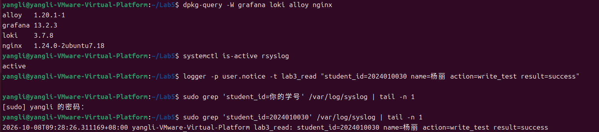
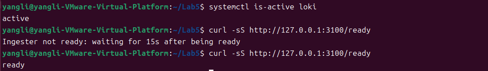
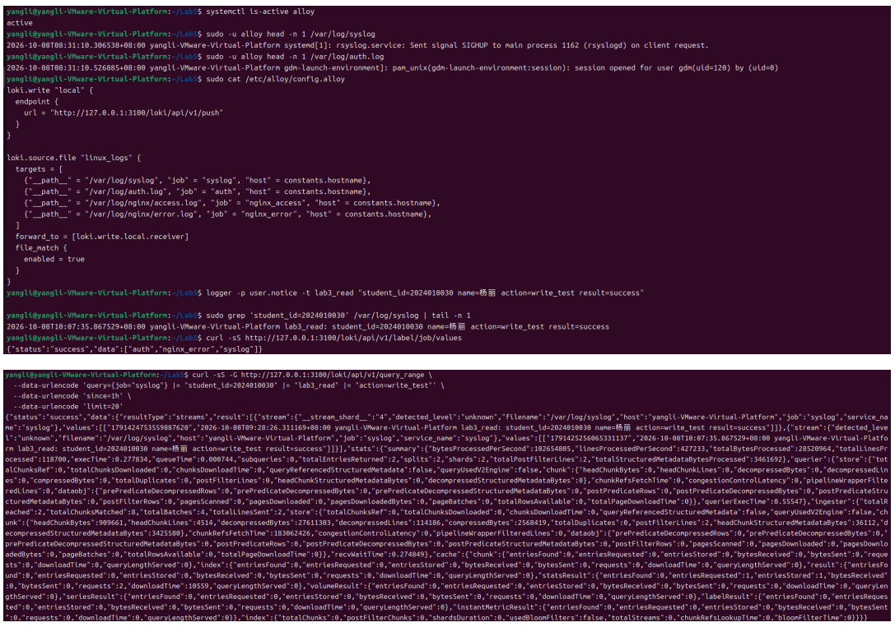
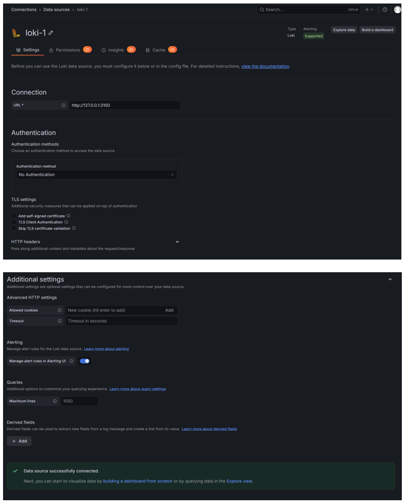
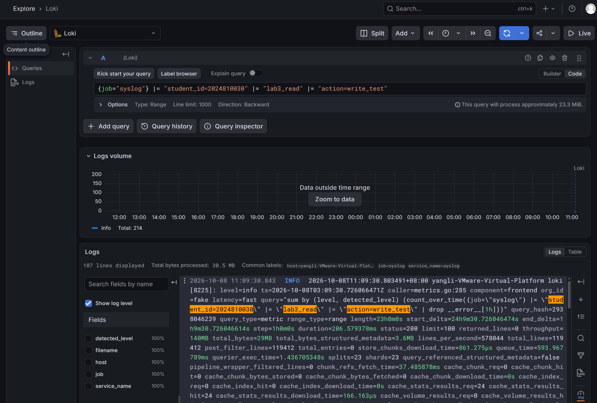

# Lab5：日志采集平台搭建与验证

本实验在 Ubuntu 虚拟机中搭建日志平台。开始前，请确认能通过 SSH 登录虚拟机，并能使用 `sudo` 运行命令。

本次用 `logger` 产生测试日志，通过 Ubuntu 默认的日志规则写入 `/var/log/syslog`，再把它收集到平台中查看。

**报告填写要求：请保留本文的题目、说明、示例、选读内容和 Markdown 排版，在填写区补充自己的结果。选读内容仍不要求执行或作答。** 本次作业启用模板数量检查，具体要求见第十节。

**本次要完成的是：写入一条带学号的新日志，再分别从本地文件、Loki 的查询接口（API）和 Grafana 网页中找到它。** 其中，API 可以用命令访问，后面会用 `curl` 来查询。

开始前请先给虚拟机拍一个快照，保留当前环境。本实验会安装软件并修改配置，建议预留 2～3 小时；下载较慢时，可以课前先安装软件，课堂上再逐步配置和检查。

---

## 一、为什么安装 Alloy、Loki 和 Grafana，为什么不用 ELK

### 1.1 为什么要安装这三个软件

Ubuntu 的日志分散在 `syslog`、`auth.log` 等文件中。排查问题时，需要登录虚拟机、逐个文件查找；如果有多台主机，还要逐台登录，难以放在一起查看。

**安装这三个软件，就是为了解决“日志分散、查找麻烦、缺少统一查看入口”的问题。** 它们把新日志自动收集到一起，让我们在浏览器里按来源、时间和关键词查询，后续还能统计和画图。本次先在一台虚拟机上练习这套过程，三个软件分别负责：

| 软件 | 在本实验中做什么 |
| :--- | :--- |
| **Alloy** | 持续读取本地日志文件，把新日志发送给 Loki |
| **Loki** | 接收并保存日志，按查询条件返回结果 |
| **Grafana** | 提供网页界面，让我们查询和查看 Loki 中的日志 |

本次日志经过的完整过程是：

```text
logger 产生日志 → rsyslog 写入 syslog → Alloy 采集 → Loki 存储和查询 → Grafana 网页展示
```

rsyslog 按 Ubuntu 默认规则把日志写入文件，logrotate 负责文件轮转，本次使用它们的默认配置。Alloy 读取这些文件，Grafana 显示查询结果。三个新软件都安装在同一台虚拟机中，按 **Loki → Alloy → Grafana** 的顺序配置。

### 1.2 为什么不用主流的 ELK

**ELK 是常见的日志平台方案，也能完成本实验。** 它由 Elasticsearch（存储和搜索）、Logstash（采集和处理）、Kibana（网页查询和展示）组成。

**本次不用 ELK，主要是因为整套系统较重，本机虚拟机的资源有限。** 三个软件同时运行会占用较多内存、CPU 和磁盘，而 Windows 电脑本身还要运行日常软件。在本课程建议的 4GB 内存虚拟机上，再运行整套 ELK 容易出现内存紧张、卡顿，配置和排错也更费时间。

本实验日志量小，先做到“自动收集、统一查询、网页查看”即可。**按本实验的配置，Alloy + Loki + Grafana 更轻量，适合有限的虚拟机资源**。这套平台满足本次的查询需要，Lab6 还会继续用它做统计和图表。ELK 可以留到资源更充足、需要学习复杂搜索与分析时再实践。

---

## 二、任务 1：检查环境并安装软件

### 2.1 检查内存、磁盘和网络

确认已经创建快照后，再检查虚拟机的内存和磁盘空间。建议至少分配 4GB 内存，后续还要留意实际占用情况。

```bash
free -h
```

`free` 查看内存，`-h` 让结果使用 MB、GB 等单位显示。重点看 `available`，它表示大约还有多少内存可用。

```bash
df -h /
```

这条命令查看 `/` 所在磁盘分区的空间。软件包和收集到的日志都会占用磁盘，如果剩余空间不足，要先腾出空间再安装。

```bash
curl -I https://mirrors.tuna.tsinghua.edu.cn/grafana/apt/dists/stable/Release
```

这条命令只查看服务器返回的响应头，不下载整个文件，用来检查能否连上清华 TUNA 镜像站。本实验从国内镜像下载软件，减少等待时间；是否安装成功，还要看后面的安装结果。

### 2.2 看清脚本要安装什么

课程脚本把安装和配置分成了几个步骤，可以减少重复输入。运行前，先了解它会安装哪些软件：

| 软件 | 为什么需要 | 本次是否重点配置 |
| :--- | :--- | :--- |
| Loki | 保存收到的日志，供后面查询 | 是，任务 2 |
| Alloy | 把现有文本日志发送给 Loki | 是，任务 3 |
| Grafana | 在浏览器中连接 Loki、查看查询结果 | 是，任务 4 |
| rsyslog、logrotate | 负责本地日志写入和文件轮转 | 脚本安装，使用 Ubuntu 默认配置 |
| nginx | 提供网页服务，访问网页时会产生日志，供 Lab6 使用 | 本次提前安装，Lab6 再配置演示站 |
| `curl`、`wget`、`gpg` 等工具 | 下载文件、验证软件包来源、向平台发送查询请求 | 安装和检查时会用到 |

**nginx 是为下一次实验准备的日志来源。** 这次用 `logger` 产生测试日志，下次会通过访问 nginx 网页产生日志。

### 2.3 安装软件包并记录版本

**报告在 Windows 上编写，软件安装和后续配置在 Ubuntu 虚拟机中完成。** 先把 Windows 课程仓库 `homework/Lab5/` 下的 `install.sh` 和 `restore.sh` 传到虚拟机，再执行安装命令。

**① 在虚拟机中准备存放脚本的目录**

使用之前演示过的 Xshell 登录 Ubuntu，也可以使用虚拟机终端或 MobaXterm 的 SSH 终端，执行：

```bash
mkdir -p ~/Lab5
```

`~` 表示当前 Ubuntu 用户的主目录，例如 `/home/zhangsan`。后续统一把脚本放在虚拟机的 `~/Lab5/` 中。

**② 从 Windows 传输脚本，任选一种方式即可**

| 方式 | 怎样操作 |
| :--- | :--- |
| **虚拟机拖放** | 如果虚拟机有图形桌面，并已安装相应的增强工具、启用拖放功能，可将两个脚本从 Windows 拖入 Ubuntu，再移到主目录下的 `Lab5` 文件夹。拖放不可用时选下面的方式。 |
| **Xftp** | 使用与 Xshell 相同的虚拟机 IP、用户名和登录方式，通过 SFTP 连接；左侧找到 Windows 中的两个脚本，右侧打开 `/home/你的用户名/Lab5/`，上传文件。 |
| **scp** | 在 Windows 的 Git Bash 中运行下面的传输命令。 |
| **MobaXterm** | 建立到虚拟机的 SSH 连接，在左侧 SFTP 文件面板中打开 `/home/你的用户名/Lab5/`，把 Windows 中的两个脚本拖入该面板上传。 |

选择 `scp` 时，在 **Windows 的课程仓库根目录**右键选择 **Open Git Bash here**，执行：

```bash
scp ./homework/Lab5/install.sh ./homework/Lab5/restore.sh 你的用户名@虚拟机IP:~/Lab5/
```

把用户名和虚拟机 IP 替换为自己的，按提示完成登录。此命令只负责传文件；上传完成后，回到连接 Ubuntu 的终端执行后续命令。

**③ 在虚拟机中检查文件并安装**

```bash
cd ~/Lab5
ls -l install.sh restore.sh
```

确认两个文件都已上传。后续 `install.sh` 的四个阶段都在虚拟机的这个目录运行，报告仍在 Windows 的 `学号姓名/Lab5/` 中填写。

先查看脚本：

```bash
less install.sh
```

先找到 `packages`、`loki`、`alloy`、`grafana` 四个部分，分别对应安装软件和配置三个服务。暂时不必读懂每一行，后面会分步说明；按 `q` 退出查看。

```bash
sudo bash install.sh packages
```

`sudo` 让命令以管理员权限运行，`bash install.sh` 表示运行这个脚本，`packages` 表示**安装所需软件，并启动负责本地日志写入的 rsyslog**。三个平台服务的课程配置将在后面完成。

Grafana、Loki 和 Alloy 从清华 TUNA 镜像下载，软件包来源仍通过 Grafana 官方签名验证。其他基础软件继续从虚拟机已有的 Ubuntu 软件源下载。

如果之前已运行旧版脚本，下载地址仍显示 `apt.grafana.com` 且速度很慢，可在下载阶段按 `Ctrl+C` 停止，将新版 `install.sh` 重新上传并覆盖虚拟机中的文件，再运行上面的命令。脚本会先替换旧的 Grafana 软件源，再继续安装。

部分软件安装后会自动启动。即使此时状态是 `active`，也还需要完成后面的课程配置，并通过查询确认日志已经收到了。

```bash
dpkg-query -W grafana loki alloy nginx
```

这条命令列出已安装软件的名称和版本。不同时间安装，版本可能不同，请记录自己的实际输出。

> **记录**
>
> Grafana、Loki、Alloy 的版本分别是什么？nginx 是否已经安装？
>
> 答：Grafana 版本：13.2.3；Loki 版本：3.7.8；Alloy 版本：1.20.1-1；nginx 版本：1.24.0-2ubuntu7.18，**nginx 已成功安装**。

下载失败时，先阅读安装命令的报错，再按提示检查网络、软件源或磁盘空间。处理后可以重新执行 `packages`。**安装成功后再继续下一步**，后面三个配置步骤不会重复下载软件。

### 2.4 写入一条测试日志

先确认 rsyslog 正在运行：

```bash
systemctl is-active rsyslog
```

正常应输出 `active`。然后使用下面的命令，把学号和姓名替换为自己的：

```bash
logger -p user.notice -t lab3_read "student_id=你的学号 name=你的姓名 action=write_test result=success"
```

`user.notice` 指定日志类别和级别，Ubuntu 的默认规则会把它写入 `/var/log/syslog`；`lab3_read` 是日志标记，方便找到自己的测试消息。

等待 1～2 秒后，查看含本人学号的最新一条记录：

```bash
sudo grep 'student_id=你的学号' /var/log/syslog | tail -n 1
```

`tail -n 1` 只显示最后一行。确认其中有自己的姓名、`action=write_test` 和 `result=success`。如果没有，先检查 rsyslog 的运行状态和 `/etc/rsyslog.d/50-default.conf` 中写入 `syslog` 的默认规则，再继续配置平台。

> **记录**：rsyslog 是否为 `active`？`/var/log/syslog` 中是否出现了本人的测试日志？
>
> 答：rsyslog 状态为 active；`/var/log/syslog`中成功出现本人的测试日志，日志内容：`student_id=2024010030 name=杨丽 action=write_test result=success`。

保存 `imgs/lab5_prepare.png`，保留本地测试日志的查询命令、本人日志和 2.3 节的软件版本输出。



---

## 三、任务 2：配置并验证 Loki

先配置 Loki，让它准备好接收和保存日志。这一步检查它能否正常工作，下一步再让 Alloy 发送日志过来。

### 3.1 配置 Loki，查看主要设置

在 Ubuntu 虚拟机存放脚本的目录中执行：

```bash
cd ~/Lab5
sudo bash install.sh loki
```

这一步只配置 Loki：脚本会备份原配置，写入适合本次实验的设置，准备保存数据的目录，再启动服务。原配置的首次备份保存在 `/opt/loglab-state/Lab5/`。

```bash
sudo cat /etc/loki/config.yml
```

查看脚本写入的配置，先找到下面几项：

| 配置项 | 本次设置 | 含义 |
| :--- | :--- | :--- |
| `http_listen_port` | `3100` | Alloy 发送日志、Grafana 查询日志时，都访问这个端口 |
| `path_prefix` | `/var/lib/loki` | Loki 保存数据时使用的基础目录 |
| `filesystem` | 保存在本地文件中 | 日志数据放在虚拟机磁盘上 |
| `replication_factor` | `1` | 只保存一份，不会再复制到另一台机器 |
| `auth_enabled` | `false` | 所有日志使用同一个空间；这项设置不提供登录验证 |

其余配置先使用脚本提供的设置，本次不要求逐项解释。重点知道 Loki 使用哪个端口、数据存在哪里。本实验没有额外设置登录验证，请只在课程虚拟机和课堂网络中使用。

### 3.2 检查 Loki 是否启动并准备好接收请求

```bash
systemctl is-active loki
```

正常应输出 `active`，表示服务已经启动。

```bash
curl -sS http://127.0.0.1:3100/ready
```

`-s` 隐藏进度条，`-S` 保留报错信息。访问 `/ready` 是在检查 Loki 是否准备好了，正常应返回 `ready`。**服务启动后可能还需要一点准备时间，所以两个检查都要做。**

刚启动时，可能看到含有 `ingester not ready` 的提示，意思是接收日志的部分还在准备。等待 30～60 秒后再试；如果一直没有返回 `ready`，查看服务日志：

```bash
sudo journalctl -u loki -n 50 --no-pager
```

这条命令直接显示 Loki 最近的 50 条服务日志。根据其中的报错，检查配置文件或数据目录的权限。

> **记录**
>
> ① 服务状态、`/ready` 返回结果和数据目录分别是什么？
>
> 答：Loki 服务状态为 active；访问`/ready`接口最终返回 ready；数据目录为`/var/lib/loki`。
>
> ② 若启动失败，报错是什么，怎样处理？未遇到则填写“未遇到”。
>
> 答：未遇到。

保存 `imgs/lab5_loki.png`，保留状态检查与 `/ready` 的命令和结果。



> **检查点**：看到 `active` 和 `ready`，说明 Loki 已经准备好了。下一步要写入并查到一条新日志，确认整个过程正常。

---

## 四、任务 3：配置 Alloy，确认日志进入 Loki

rsyslog 负责把日志写入文件，Alloy 负责读取文件并发送给 Loki。接下来要确认两件事：Alloy 有权限读这些文件，发送地址也配置正确。

### 4.1 配置 Alloy，检查它能否读取日志

```bash
cd ~/Lab5
sudo bash install.sh alloy
```

脚本会写入 Alloy 配置，并把运行服务的 `alloy` 用户加入 `adm` 用户组。Ubuntu 上的许多日志允许这个组的成员读取，重启服务后，新权限才能生效。

```bash
systemctl is-active alloy
```

正常应输出 `active`。随后以 `alloy` 用户的身份，试着读取一行日志：

```bash
sudo -u alloy head -n 1 /var/log/syslog
```

`sudo -u alloy` 指定使用 `alloy` 用户，`head -n 1` 只读第一行。正常应显示一行日志；如果出现 `Permission denied`，说明没有读取权限。

```bash
sudo -u alloy head -n 1 /var/log/auth.log
```

这次读取的是 `auth.log`，它通常记录登录、sudo 等活动。管理员 root 能读，不代表 Alloy 也能读。遇到权限错误时，检查文件所属的用户组和目录权限，不要直接改成所有人都能读写的 `777`。

### 4.2 看懂“从哪里读”和“往哪里发”

```bash
sudo cat /etc/alloy/config.alloy
```

先找到负责发送日志的这一段：

```hcl
loki.write "local" {
  endpoint {
    url = "http://127.0.0.1:3100/loki/api/v1/push"
  }
}
```

`loki.write` 负责发送日志，`"local"` 是给这一段配置起的名字。`endpoint` 里的 `url` 就是接收日志的地址。这里的 `127.0.0.1` 表示 Alloy 所在的 Ubuntu 虚拟机。

再找到负责读文件的 `loki.source.file "linux_logs"`，重点看下面几项：

| 配置内容 | 回答的问题 |
| :--- | :--- |
| `targets` 中的 `__path__` | 从哪个路径读取文件？ |
| `targets` 中的 `job`、`host` | 给日志加上哪些来源标记，也就是“标签”？ |
| `file_match` | 是否定期检查这些路径下有没有新文件？ |
| `forward_to` | 读到的日志交给谁发送？这里交给 `loki.write.local.receiver`，也就是上面的发送部分 |

本次读取以下文件，并用 `job` 区分来源：

| 采集路径 | `job` 标签 | 本次要求 |
| :--- | :--- | :--- |
| `/var/log/syslog` | `syslog` | 查到本人通过 logger 写入的测试日志 |
| `/var/log/auth.log` | `auth` | 验证权限，并查询 sudo 活动 |
| `/var/log/nginx/access.log` | `nginx_access` | 提前配置，Lab6 用真实 HTTP 请求产生数据后验证 |
| `/var/log/nginx/error.log` | `nginx_error` | 提前配置，有错误记录时才有可查询的数据 |

**标签可以理解为日志的来源说明**：`job` 表示哪一类日志，`host` 表示来自哪台主机，`filename` 表示来自哪个文件。所有标签都相同的日志归为一组，Loki 把这样的一组叫作“日志流”。同一条消息从不同文件读入，标签不同，就会分到不同的组。

标签也需要控制数量。`job` 通常只有几类，HTTP 状态码（如 `200`、`404`）的种类也有限；完整 URI（请求地址，如 `/news?page=1`）却可能有大量不同值。把这些变化很多的内容都作为标签，会产生太多日志组，增加存储和查询的负担。

本次只读取表中的当前日志文件，不重新导入 `.1`、`.gz` 等旧日志。Alloy 会记住读到了哪里；只要这份记录和日志文件正常保留，重启后就可以接着读。

> **注意查询结果中的时间**
> 按本次配置，Loki 中的时间是 Alloy 读到日志的时间，没有使用日志正文里原本的时间。因此，旧文件刚被读取时，其中的旧日志也可能出现在“最近一小时”里。后面要重新发送一条测试日志，并对照正文里的时间确认是刚写入的那条，才能说明新日志也在正常收集。

> **记录**
>
> ① Alloy 能否正常读取上面的两个文件？
>
> 答：Alloy 可以正常读取 `/var/log/syslog` 和 `/var/log/auth.log`。
>
> ② 哪个配置项决定“读哪个文件”？哪个决定“发到哪里”？`forward_to` 把读到的日志交给了谁？
>
> 答：`loki.source.file` 的`targets`里的`__path__`决定读取哪些日志文件；`loki.write`块内`endpoint`的 url 决定日志发送的目标地址；`forward_to`将读到的日志交给`loki.write.local.receiver`。

### 4.3 写入新日志，用 API 查到同一条记录

Alloy 启动后，再执行一次写日志的命令：

```bash
logger -p user.notice -t lab3_read "student_id=你的学号 name=你的姓名 action=write_test result=success"
```

把学号和姓名替换为自己的，再查看本地最新一条记录：

```bash
sudo grep 'student_id=你的学号' /var/log/syslog | tail -n 1
```

先确认这条日志已经写入本地文件。如果暂时没有结果，等 1～2 秒再查；找到后记下这行日志的时间，再检查 Alloy 是否把它送到了 Loki。

等待约 15 秒，给 Alloy 留出读取和发送的时间，再查看 Loki 里有哪些日志来源：

```bash
curl -sS http://127.0.0.1:3100/loki/api/v1/label/job/values
```

返回的 `job` 列表中应包含 `syslog`。其他来源只有在读到日志后才会出现，暂时没有 nginx 的记录不影响本次实验。

**接着查找刚才那条带学号的新日志：**

```bash
curl -sS -G http://127.0.0.1:3100/loki/api/v1/query_range \
  --data-urlencode 'query={job="syslog"} |= "student_id=你的学号" |= "lab3_read" |= "action=write_test"' \
  --data-urlencode 'since=1h' \
  --data-urlencode 'limit=20'
```

这是一条分成多行书写的命令，行尾 `\` 表示下一行仍属于同一条命令。查询中的学号也要替换为自己的。`query=` 后面的查询语句叫作 **LogQL**，用来告诉 Loki“查哪个来源、找什么内容”。

| 参数或内容 | 含义 |
| :--- | :--- |
| `-G` | 把后面的查询条件放到请求地址中，用 GET 方式发送 |
| `--data-urlencode` | 处理查询中的空格、引号等符号，让它们能正确传给 Loki |
| `query=...` | 告诉 Loki 要查什么 |
| `{job="syslog"}` | 先选择 `job` 为 `syslog` 的日志 |
| `\|= "文本"` | 再要求日志正文包含这段文本，多个过滤条件要同时满足 |
| `since=1h` | 查询最近一小时的范围 |
| `limit=20` | 最多返回 20 条日志 |

返回结果使用 JSON 格式，可以重点看两处：`status` 为 `success` 表示查询正常执行，`data.result` 才是查到的日志。**要找到自己的学号和 `action=write_test`，并核对日志正文中的时间与刚才本地最新一行一致。** 如果结果为空，或只有之前的旧记录，还需要继续检查。

> **记录**
>
> ① 返回了哪些 `job`？API 返回的本人新日志原文是什么？
>
> 答：返回的 job 有`auth`、`nginx_error`、`syslog`。API 返回本人新日志原文是：
`2026-10-08T10:07:35.867529+08:00 yangli-VMware-Virtual-Platform lab3_read: student_id=2024010030 name=杨丽 action=write_test result=success`。
>
> ② 如果只看到 `success`，而 `data.result` 为空，你会先检查什么？
>
> 答：首先检查查询时间区间是否包含日志产生时间；再检查 LogQL 查询语句的标签与关键词拼写；查看 Alloy 服务是否正常运行、是否成功采集并推送日志；确认本地/var/log/syslog是否存在该日志；Loki 写入存在延迟，等待片刻重试查询。

保存 `imgs/lab5_alloy.png`，保留文件读取权限验证、`job` 查询和包含本人日志的 API 结果；可以合理拼图。



---

## 五、任务 4：配置 Grafana，在网页查到日志

用 API 查到新日志后，就可以接上 Grafana，在网页中查看同一条记录了。如果 API 还查不到，请先按第四节检查日志是否已送到 Loki。

### 5.1 让 Grafana 连接 Loki

```bash
cd ~/Lab5
sudo bash install.sh grafana
```

脚本会告诉 Grafana 到哪里查询日志，并启动 Grafana。这样的连接设置在界面里叫作“数据源”，本次数据源的名字是 **Loki**。

```bash
systemctl is-active grafana-server
```

注意 Grafana 的服务名是 `grafana-server`。正常应输出 `active`。

```bash
sudo cat /etc/grafana/provisioning/datasources/loki.yml
```

找到其中的 `http://127.0.0.1:3100`。这是 **Grafana 用来访问 Loki** 的地址。两个软件都在 Ubuntu 虚拟机里，因此这里的 `127.0.0.1` 就是它们所在的这台虚拟机。

```bash
hostname -I
```

大写 `-I` 列出虚拟机的 IP 地址。选择 Windows 能够访问的那个地址，通常就是 Xshell 连接时使用的 IP。

在 **Windows 浏览器**打开 `http://虚拟机IP:3000`。首次登录默认账号和密码都是 `admin`，登录后按页面提示修改密码；已经设置过则使用自己的密码。**报告和截图中不要出现密码。**

| 访问方向 | 本次地址 | 为什么这样写 |
| :--- | :--- | :--- |
| Windows 浏览器 → Grafana | `http://虚拟机IP:3000` | Windows 上的 `127.0.0.1` 指向 Windows 自己，要用虚拟机 IP 才能找到 Grafana |
| Grafana → Loki | `http://127.0.0.1:3100` | 两个软件都在虚拟机内，可以直接通过本机地址连接 |

进入 **Connections → Data sources → Loki**，点击 **Test** 或 **Save & test**（不同版本名称略有不同），确认出现连接成功的提示。

> **记录**：浏览器实际访问地址是什么？为什么浏览器用虚拟机 IP，而数据源配置里可以用 `127.0.0.1`？
>
> 答：浏览器实际访问地址是：**虚拟机网卡 IP（192.168.161.128:3000）**。浏览器用虚拟机 IP，而数据源配置里可以用 `127.0.0.1`的原因：浏览器在宿主机，宿主机不能访问虚拟机内的`127.0.0.1`，因此浏览器使用虚拟机局域网 IP 访问 Grafana；数据源填写`127.0.0.1`，是**虚拟机内的 Grafana**访问同虚拟机上的 Loki，`127.0.0.1`为本机回环地址。

保存 `imgs/lab5_datasource.png`，保留 Loki 数据源名称、连接地址和测试成功的结果。



### 5.2 在 Explore 页面查询自己的日志

打开查询页面 **Explore**，选择 **Loki** 数据源，再选择 **Code** 模式，这样就可以直接输入查询语句。

**查询语句怎么写？先选来源，再筛选文字。** 例如：

```logql
{job="syslog"} |= "lab3_read" |= "student_id=你的学号"
```

从左到右读，就能看懂它在查什么：

| 这一段 | 含义 |
| :--- | :--- |
| `{job="syslog"}` | 从 `syslog` 这个来源中查找日志。`job` 的值来自 Alloy 的采集配置 |
| `\|= "lab3_read"` | 只保留正文中包含 `lab3_read` 的记录，也就是我们写日志时使用的标记 |
| `\|= "student_id=你的学号"` | 再筛选出自己的记录，使用前换成实际学号 |

花括号里的 `=` 表示标签值相等，花括号外的 `|=` 表示正文包含指定文字。**多个 `|=` 要同时满足**，每增加一个条件，就是进一步缩小结果范围。文字匹配区分大小写，输入时使用英文双引号。

**时间范围在页面上设置。** 把它设为 **Last 1 hour**（最近一小时），查询就只查看这段时间内的日志；不用把 API 命令里的 `since=1h` 写进查询框。

现在再加上 `action=write_test`，只看这次写入测试的记录。下面这条与 4.3 节的查询相同，替换学号后输入：

```logql
{job="syslog"} |= "student_id=你的学号" |= "lab3_read" |= "action=write_test"
```

在网页中直接输入查询语句即可，不需要加 `query=`。点击 **Run query** 执行查询，再展开自己的日志，查看 `job`、`host`、`filename`。

核对日志内容是否与 API 查到的一致。它的 `job` 应为 `syslog`，`filename` 应为 `/var/log/syslog`。如果距离写入已经超过一小时，可以扩大时间范围，或重新发送一条测试日志。

> **记录**
>
> ① 网页查到的完整日志原文是什么？与 API 返回的记录是否一致？
>
> 答：网页查询到的日志原文：student_id=2024810030 lab3_read action=write_test；Grafana 页面查询出来的日志内容与 API 写入返回的记录一致，日志文本、时间信息相互匹配。
>
> ② 这条日志的 `job`、`host`、`filename` 分别是什么？
>
> 答：job 为`syslog`；host 为`yangli-VMware-Virtual-Platform`；filename 为`/var/log/syslog`。

保存 `imgs/lab5_explore.png`，保留数据源、时间范围、查询语句、本人日志正文和展开后的标签。



---

## 六、任务 5：继续练习日志查询

### 6.1 按结果筛选测试日志

前面按 `action=write_test` 查找了测试日志，也可以按结果查找。在 Explore 中输入：

```logql
{job="syslog"} |= "student_id=你的学号" |= "lab3_read" |= "result=success"
```

这条查询仍然从 `syslog` 中查找本人日志，只是把最后一个条件换成了 `result=success`。可以看到，`job` 决定从哪里查，后面的文字条件决定保留哪些记录。

> **记录**：这条查询查到了什么？其中 `job="syslog"` 和 `|= "result=success"` 各起什么作用？
>
> 答：该查询从 syslog 日志流中，查找包含本人学号、`lab3_read`、`result=success`的日志记录。
`job="syslog"`：标签匹配，限定日志来源，只读取标签 job 等于 syslog 的日志流；
`|= "result=success"`：行过滤，只保留日志正文里面包含字符串`result=success`的日志行。

### 6.2 查找一次 sudo 操作的日志

在虚拟机里执行：

```bash
sudo -k
```

`sudo` 通常会暂时记住最近一次密码验证。`-k` 会清除这个记录，让下一次需要密码的 sudo 操作重新提示输入；它不会修改密码。

```bash
sudo true
```

`true` 本身不做其他操作，只表示命令成功结束。这里通过 sudo 运行它，是为了留下一条 sudo 操作记录。按提示输入密码即可，不要写进报告。

在 Explore 中查询：

```logql
{job="auth"} |= "sudo"
```

这条查询在 `auth` 来源中查找包含 `sudo` 的日志。如果没有结果，检查 `/var/log/auth.log` 是否出现新行、Alloy 能否读取，以及网页的时间范围是否合适。

### 6.3 记录查询结果，保留实验环境

把实际用过的三条查询写在下面，学号等内容要换成自己的，**让查询语句可以直接复制使用**。除了截图，也要用文字简单说明查到了什么。

| 查询目的 | 实际 LogQL | 查到的结果摘要 |
| :--- | :--- | :--- |
| 在 syslog 中查本人测试日志 | `{job="syslog"} \|= "student_id=2024810030" \|= "lab3_read" \|= "action=write_test"` | 查询syslog中本人测试日志，包含学号、lab3_read、action=write_test文本 |
| 筛选本人结果为 success 的测试日志 | `{job="syslog"} \|= "student_id=2024810030" \|= "lab3_read" \|= "result=success"` | 查询本人测试日志，日志内容包含`result=success`，代表测试执行成功 |
| 查询 sudo 认证活动 | `{job="auth"} \|= "sudo"` | 查询auth日志源，获取sudo认证会话记录，包含会话打开、认证、关闭日志 |

完成这三条查询后，你就检查了日志从写入文件、发送到 Loki，再到网页显示的整个过程，也比较了不同来源的记录。

**完成后保留本次安装的软件和配置，并创建“Lab5 平台可用”快照。** 下次还要接着使用，正常结束实验时不运行 `restore.sh`。

Lab6 会继续使用这些成果：

| Lab5 留下的成果 | Lab6 怎样继续使用 |
| :--- | :--- |
| 已安装的 nginx | 在 8080 端口配置演示网站，通过访问网页产生日志 |
| 已配置的 `nginx_access` 采集路径 | 继续用 Alloy 读取新生成的 access.log |
| 可用的 Loki 和 Grafana 数据源 | 不重装平台，直接在 Explore 查询 nginx 日志 |
| `{job="..."}` 与 `\|=` 过滤 | 先找到自己的访问记录，再提取状态码等内容 |
| 日志来源和采集时间 | 确定统计哪些日志、哪个时间段 |

本次还没有 nginx 日志也没关系，Lab6 会通过实际访问网页来产生。到时将继续学习：**怎样从日志中找出状态码，怎样统计最近五分钟的访问次数。**

---

## 七、知识问答

每题用 1～3 句话回答，无需另做实验。

1. 本地文件里有自己的日志，但用 Loki API 查不到，你会先检查哪两处？如果 API 能查到，而网页查不到，又该检查什么？

   > 填写：API 能查到但 Grafana 网页查不到：检查 Grafana 里 Loki 数据源配置，还有查询的时间范围是否匹配日志时间；API 能查到但 Grafana 网页查不到：检查 Grafana 里 Loki 数据源配置，还有查询的时间范围是否匹配日志时间。

2. 用自己的话说明，一条日志怎样经过“logger → 文件 → Alloy → Loki → Grafana”。rsyslog 和 Alloy 分别做什么？日志内容由 Grafana 保存吗？

   > 填写：logger 生成日志写入本地文件；Alloy 读取文件日志，加上标签后发送给 Loki；Loki 存储索引与日志；Grafana 向 Loki 查询并可视化展示日志。rsyslog 负责收集系统日志写入文件；Alloy 采集本地日志、打标签并上报 Loki。**Grafana 不保存日志内容，只做查询展示**。

3. `job`、完整 URI（请求地址）、HTTP 状态码，哪些通常只有少量不同值，哪些可能有很多？为什么不适合把日志里的所有内容都作为标签保存？

   > 填写：job、HTTP 状态码只有少量不同值；完整 URI 会有大量不同值。标签索引会占用大量存储，若把日志全部内容作为标签，会产生海量唯一标签，造成标签基数爆炸，Loki 查询性能急剧下降。

---

## 八、常见问题

| 现象 | 原因 | 处理 |
| :--- | :--- | :--- |
| 脚本提示 `$'\r': command not found` 等错误 | 文件使用了 Windows 的换行格式，Bash 无法正确读取 | 在虚拟机的 `~/Lab5/` 中执行 `sed -i 's/\r$//' install.sh restore.sh`，再重试原命令 |
| `packages` 安装失败 | 可能是网络、软件源或磁盘空间问题，具体看报错 | 按报错提示处理，再重新运行安装命令；安装成功后继续配置 |
| 配置 Loki 时提示 `install: invalid group 'loki'` | 旧版脚本假定用户组也叫 `loki`，但实际组名可能不同 | 用 `id loki` 查看用户和组；上传新版 `install.sh` 后重新运行 `sudo bash install.sh loki`，脚本会使用实际组名 |
| 发了消息，syslog 中没有新行 | rsyslog 未运行，或系统默认的日志规则被修改 | 检查 `systemctl is-active rsyslog` 和 `/etc/rsyslog.d/50-default.conf`，确认有写入 `/var/log/syslog` 的规则 |
| Loki 显示 `active`，但 `/ready` 没返回 `ready` | 可能还在启动，也可能是配置或数据目录有问题 | 先等 30～60 秒；一直不成功时查看 `journalctl -u loki` |
| Alloy 读不了日志 | `alloy` 用户没有权限读文件或进入目录 | 用 `sudo -u alloy head -n 1 文件` 检查，再核对 `adm` 组和文件、目录权限；修改后重启 Alloy |
| API 返回 `success`，但结果为空 | 查询执行了，但没找到符合条件的日志 | 依次检查本地有没有新行、Alloy 能否读取、Alloy 是否报错，最后核对查询条件和时间范围 |
| API 能查到本人日志，网页却查不到 | 网页使用的数据源、时间范围或查询条件不一致 | 在网页中使用与 API 相同的查询，核对是否选中了 Loki 和正确的时间范围 |
| Windows 浏览器打不开 Grafana | 服务未启动，或 IP、网络、防火墙设置有问题 | 先在虚拟机用 `curl -I http://127.0.0.1:3000` 检查服务，再检查网络；不要关闭全部防火墙规则 |
| 找不到 `nginx_access` 或 `nginx_error` | 还没有产生日志，或没有错误记录 | 本次不要求这两个来源有数据，Lab6 访问网页后再检查 |
| 旧日志出现在最近的时间范围内 | 本次使用 Alloy 读到日志的时间 | 重新写入一条带标记的日志来检查，注意区分日志产生和被读取的时间 |
| 想撤销本次配置或重新搭建 | 需要恢复原来的配置文件 | 先阅读 9.2 节，确认恢复脚本会做什么；正常结束实验时不用执行 |

---

## 九、选读内容

**本节不要求执行、填写或截图**，供感兴趣时查阅。

### 9.1 在 Explore 中观察实时日志

Explore 的 **Live** 模式会持续显示新收到的日志。可以先打开 `{job="syslog"} |= "lab3_read"` 的实时查询，再在终端执行一次 2.4 节的 logger 命令，观察它多久会出现在网页中。

这是同一批日志的另一种查看方式，不需要另外提交截图。

### 9.2 恢复脚本能恢复什么，不能恢复什么

如果要撤销本次配置，可以使用上传到虚拟机的 `~/Lab5/restore.sh`。它会停止 Loki、Alloy、Grafana，并恢复第一次配置前备份的文件。**软件、Loki 中的日志、Grafana 中的仪表盘（Dashboard）都会保留，软件源和用户组设置也不会撤销。**

这个脚本只恢复部分配置，效果与恢复虚拟机快照不同。运行后平台会停止服务，Lab6 就无法直接继续，所以正常完成实验时请保留当前环境。

备份放在 `/opt/loglab-state/Lab5/`。如果之后想重新启用课程平台，在虚拟机的 `~/Lab5/` 中依次运行 `sudo bash install.sh loki`、`sudo bash install.sh alloy`、`sudo bash install.sh grafana`，再按第二至五节检查能否正常写入、收集和查询日志。

### 9.3 进阶阅读

- [Loki 概述](https://grafana.com/docs/loki/latest/get-started/overview/)：了解 Loki 怎样保存和查询日志。
- [Grafana Alloy 简介](https://grafana.com/docs/alloy/latest/introduction/)：了解日志采集之外的能力。
- [Promtail 生命周期说明](https://grafana.com/docs/loki/latest/send-data/promtail/)：旧教程中常见的采集工具，了解它停止维护后的替代建议。
- [Elastic Stack 概览](https://www.elastic.co/docs/get-started/the-stack)：对照 Elasticsearch、Kibana、Logstash、Elastic Agent 和 Beats 的分工。
- [OpenSearch 文档](https://docs.opensearch.org/latest/)：了解另一套搜索与分析平台。

阅读时先关注三个问题：谁负责收集，谁负责保存和查询，谁负责展示。熟悉这些分工后，再了解各工具的具体功能。

---

## 十、截图与提交

在 Windows 上，将本文件复制到自己的“学号姓名”文件夹下，保存为 `Lab5/Lab5.md`，并在 `Lab5/` 中创建 `imgs/` 目录。每个任务旁边都有填写区和图片位置，做完一项就记录一项。

**请完整保留模板，在填写区增加答案、实际命令和日志结果。** 自动审核会检查报告的总行数、非空行数，以及 `#`、`-`、`*`、反引号、`|`、`>` 六类字符的数量，每一项都不能少于发布模板。不要删减说明、示例或选读，也不要删除表格、引用和代码块的排版符号。数量检查通过后，还会继续审核回答和截图是否符合实验要求。

本次单独提交 **1 份 Markdown 报告和 5 张截图**。报告中要填写各处记录、三条实际查询和三道简答题。提交前，按下表检查截图是否齐全。

| 操作位置 | 截图必须体现的内容 | 文件名 |
| :--- | :--- | :--- |
| 2.3、2.4 节 | 本地测试日志的查询命令、本人学号和软件版本 | `lab5_prepare.png` |
| 3.2 节 | Loki 服务状态、`/ready` 请求与返回结果 | `lab5_loki.png` |
| 4.1、4.3 节 | Alloy 读取权限、job 标签与包含本人新日志的 API 结果 | `lab5_alloy.png` |
| 5.1 节 | Loki 数据源、连接地址与测试成功结果 | `lab5_datasource.png` |
| 5.2 节 | Explore 的数据源、时间范围、查询、本人日志与展开标签 | `lab5_explore.png` |

- 使用电脑截图，保证文字清晰，不使用手机拍摄屏幕。
- 终端截图应同时显示命令和对应输出，并能辨认本人虚拟机的用户名或主机名。
- 查询页面截图要保留数据源、时间范围、查询语句和关键结果；数据源设置页面按上表截图。
- 同一任务可以拼图，也可以裁掉无关区域，但要保留命令、时间和关键结果。
- 使用本人实验结果，截图中不得出现密码、私钥或访问令牌。
- 图片放在 `imgs/` 中，文件名、扩展名和大小写都要与表格一致，确保报告能正常显示图片。

提交前确认目录结构：

```text
学号姓名/
└── Lab5/
    ├── Lab5.md
    └── imgs/
        ├── lab5_prepare.png
        ├── lab5_loki.png
        ├── lab5_alloy.png
        ├── lab5_datasource.png
        └── lab5_explore.png
```

按仓库 README 的流程单独提交 Lab5，PR 标题为 `[学号姓名]Lab5作业提交`。

---

## 十一、截止时间

**2026 年 10 月 15 日 23:59:59（北京时间）**

请在截止时间前创建 Lab5 的 PR 并完成推送。按仓库 `README.md` 第 4 节的规则，从 10 月 16 日 00:00 起，新建 PR 或继续向已有 PR 推送修改都算超时。如果审核要求修改，也要在截止前完成。
