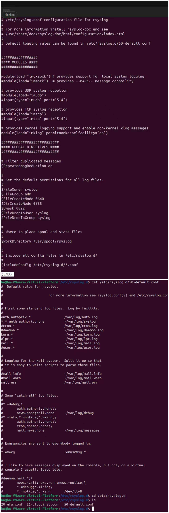
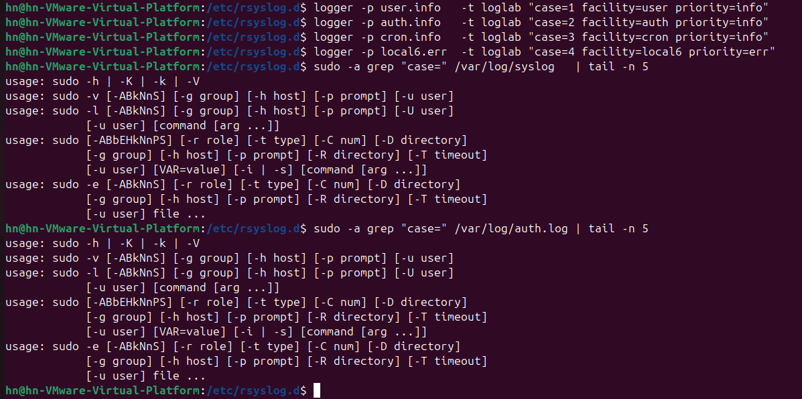
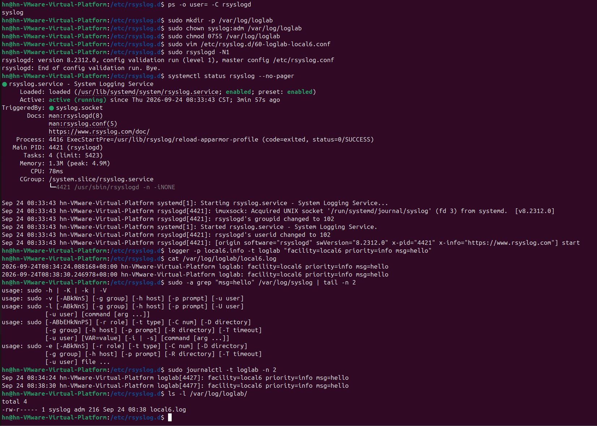
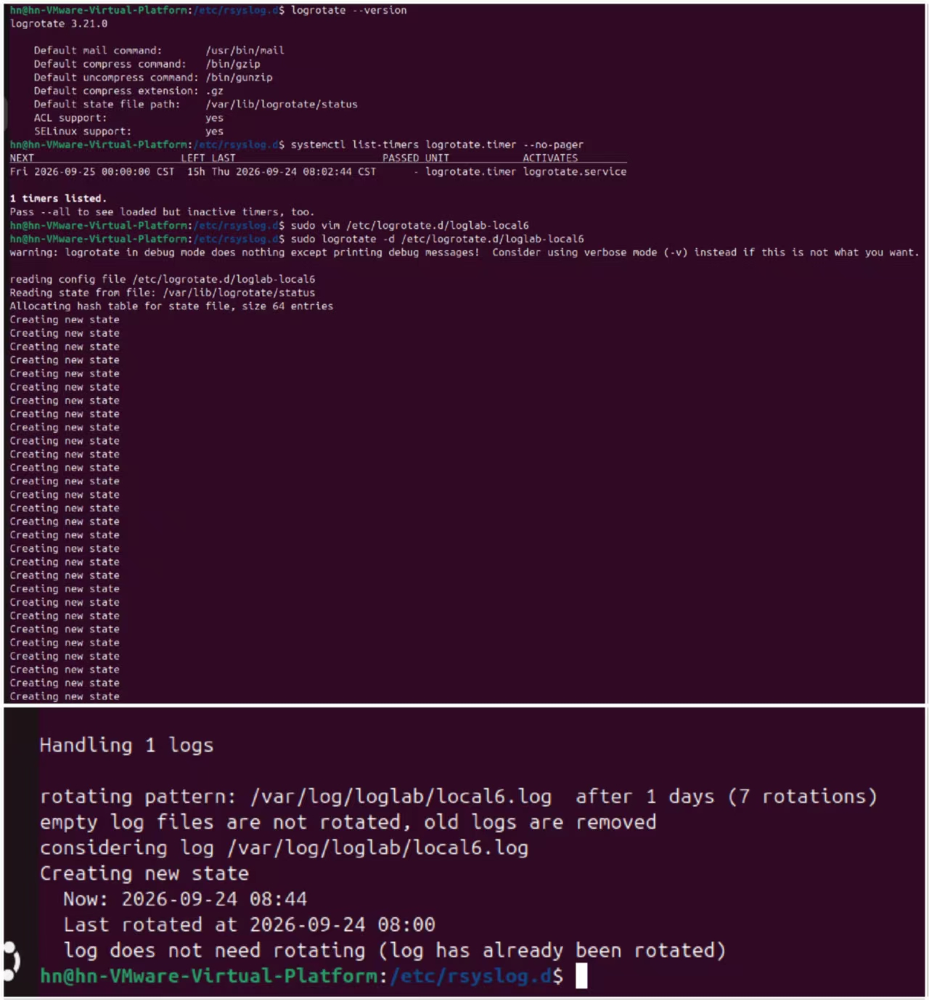
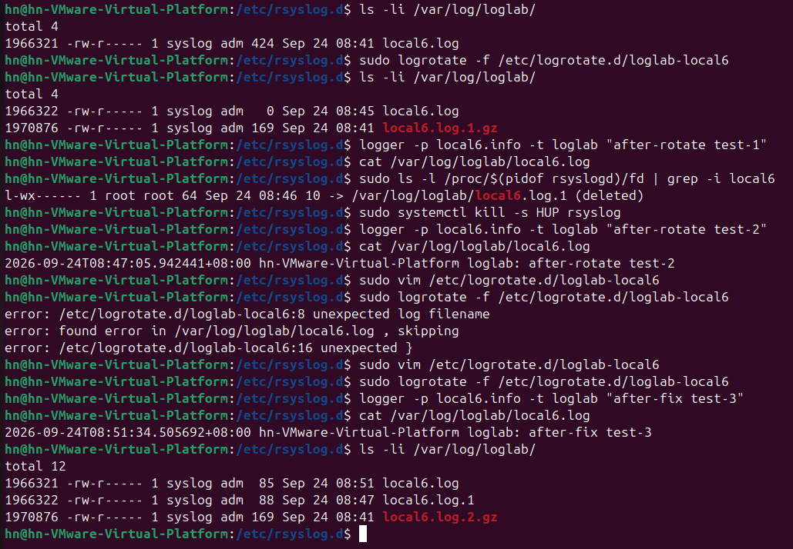

# Lab4：Linux 日志分流与轮转

本实验承接 [Lab1：日志实验环境验收](../Lab1/Lab1.md)、[Lab2：Linux 日志认识与查询](../Lab2/Lab2.md) 和 [Lab3：Linux 日志事件分析与对照](../Lab3/Lab3.md)，继续使用同一台 Ubuntu 虚拟机。开始前应已具备以下条件：

- Ubuntu 已装好 `rsyslog`，`/var/log/syslog` 与 `/var/log/auth.log` 都存在（Lab1 任务五）；
- 能用 Git Bash 通过 SSH 登录 Ubuntu，会用 `journalctl` 和 `grep` 读日志（Lab2 3.3、3.5 节）；
- 用 `logger -p user.notice -t lab3_read "..."` 写过一条自定义日志，并确认它在 journal 和 `/var/log/syslog` 里都能查到（Lab3 3.2 节）。

**Lab3 给你留了一个问题。** 同一条 `logger` 消息，为什么既能在 `journalctl` 里查到，又能在 `/var/log/syslog` 里查到？Lab3 第五节的第 1 题问的就是这件事。现在接着往下问一层：

> 消息走到 rsyslog 之后，**是谁决定它该写进哪个文件**？

答案是 rsyslog 的**分流规则**，规则写在 `/etc/rsyslog.d/` 目录下的配置文件里。Lab2 和 Lab3 你看的都是系统已经配好的结果；本实验要自己写一条规则，再给这条规则产生的新日志配上轮转策略——本实验会自己增加一条日志分流规则，并配置对应的轮转策略。

Lab1 到 Lab3 主要是查看和分析日志。本实验开始涉及系统配置修改，需要观察修改后的结果，并在出现问题时能够恢复。开始前请先给虚拟机拍一个快照（见 [Lab1 操作手册](../Lab1/操作手册.md) 第九节末尾的"创建课程基线快照"），方便出错后恢复。本实验建议预留 2～3 小时。

---

## 一、实验目标与完成顺序

将本文件复制到自己的"学号姓名"文件夹下，保存为 `Lab4/Lab4.md`，并在 `Lab4/` 中创建 `imgs/` 目录。**填写区和图片引用都在对应任务旁边，每做完一项就就地记录。**

| 任务 | 难度 | 完成内容 | 操作与填写位置 |
| :--- | :---: | :--- | :--- |
| 认识两个标签 | ★ | 弄清 facility 和 priority，看懂 `local6.*` 这类选择器 | 第二节 |
| 任务 1：读默认规则 | ★ | 找到 `/etc/rsyslog.conf` 与 `50-default.conf`，解释 auth 与 syslog 的分流 | 第三节 |
| 任务 2：打靶实验 | ★★ | 先猜后用 `logger -p` 发出 user/auth/cron/local6 四类消息，观察各自落点 | 第四节 |
| 任务 3：新建通道 | ★★ | 写 `60-loglab-local6.conf`，让 local6 日志进入 `/var/log/loglab/local6.log` | 第五节 |
| 任务 4：配置轮转 | ★★★ | 为 local6.log 写 logrotate 配置并执行 dry-run 演练 | 第六节 |
| 任务 5：复现并修复事故 | ★★★ | 强制轮转，观察日志丢失，再用 postrotate 根治 | 第七节 |
| 简短总结 | ★ | 回答 3 道知识问答题 | 第八节 |

**提交内容：1 份默认规则解读、1 张打靶观察表、1 条新分流规则、1 份轮转配置、4 项轮转证据、3 道简答题、5 张截图。**

建议按照任务顺序完成。任务 3 和任务 4 的配置会在任务 5 中继续使用，中间的验证结果也会用于后面的排错。

标为"选读"的内容不要求执行、填写或截图。遇到问题时查阅第九节，完成后按第十一、十二节核对文件和截止时间。

---

## 二、日志的两个"隐藏标签"：facility 与 priority

回顾 Lab3 3.2 节使用过的命令：

```bash
logger -p user.notice -t lab3_read "student_id=你的学号 name=你的姓名 action=write_test result=success"
```

当时你关注的是 `-t lab3_read` 这个标签和引号里的正文。现在回头看 `-p` 后面的那一小段 **`user.notice`**——这里实际上包含两个字段：`user` 和 `notice`。

每条 syslog 消息除了正文，都随身带着这两个标签。Lab2 第一节的那张图里，消息先从 journald 走到 rsyslog，这两个标签一路都跟着走：

| 标签 | 回答的问题 | 取值范围 |
| :--- | :--- | :--- |
| **facility**（设施） | 这条日志**是哪一类**？ | 24 个编号 0～23，常用的见 2.1 节 |
| **priority**（级别） | 这条日志**有多严重**？ | 8 级，数字越小越严重，见 2.2 节 |

rsyslog 的分流规则，就是拿这两个标签做判断，决定把消息写进哪个文件。下面分别说明这两个字段。

### 2.1 facility：日志类别

facility 一共 24 种。本实验只会用到下面这几个，其余遇到再查：

| facility | 编号 | 含义 | 本实验在哪里用到 |
| :--- | :---: | :--- | :--- |
| `kern` | 0 | 内核 | 任务 1 会在默认规则里看到 |
| `user` | 1 | 普通用户程序（**`logger` 不写 `-p` 时的默认值**） | 任务 2 |
| `auth` | 4 | 认证与安全（较早期的用法） | 任务 1、任务 2 |
| `syslog` | 5 | rsyslog 自己 | — |
| `cron` | 9 | 定时任务 | 任务 2 |
| `authpriv` | 10 | 认证与安全（现代 sshd、sudo 用的是这个） | 任务 1 |
| `local0`～`local7` | 16～23 | **保留给用户和单位自定义**，系统不占用 | 任务 2、任务 3 |

> **为什么用 `local6`**
> `local0`～`local7` 可用于自定义日志。本实验统一使用 `local6`，主要是为了便于和后面的配置、截图对应。

### 2.2 priority：日志级别

Lab3 3.5 节的查询三已经列过这 8 个级别：**数字越小越严重**。

| 级别 | 编号 | 级别 | 编号 |
| :--- | :---: | :--- | :---: |
| `emerg` 系统不可用 | 0 | `warning` 警告 | 4 |
| `alert` 必须立即处理 | 1 | `notice` 值得注意的正常事件 | 5 |
| `crit` 严重故障 | 2 | `info` 一般信息 | 6 |
| `err` 错误 | 3 | `debug` 调试信息 | 7 |

回顾 Lab1 任务五和 Lab3 3.2 节的两条命令：

- `logger -t lab1-check "..."` 没写 `-p`，所以走默认的 `user.notice`；
- `logger -p user.notice -t lab3_read "..."` 写明了 `-p user.notice`，和默认值一样。

因此两条消息会匹配相同的默认分流规则。

### 2.3 选择器：`设施.级别`

分流规则的一行分两列：**选择器 + 动作**。

```text
选择器                    动作
local6.*                  /var/log/loglab/local6.log
```

选择器有三种最常见的写法：

| 写法 | 含义 |
| :--- | :--- |
| `mail.err` | mail 设施中 **err 及更严重**（err / crit / alert / emerg） |
| `mail.=err` | 只有 err 这一级；多一个等号 `=` 表示精确匹配 |
| `mail.*` | mail 设施的全部级别 |

再记两条组词规则：

- **逗号表示"或者"**：写出 `auth,authpriv.*`，意思是 auth 或 authpriv；
- **分号后面可以排除**：写出 `*.*;auth,authpriv.none`，意思是"所有设施的所有级别，但把 auth 和 authpriv 排除掉"，其中 `none` 就是"这一类不要"。

动作列本实验只会用到两种：

| 写法 | 含义 |
| :--- | :--- |
| `/var/log/xxx.log` | 把消息写进这个文件 |
| `-/var/log/xxx.log` | 同上，行首多一个 `-` 表示**异步写**（不必每条都立刻刷盘，性能更好） |

> **注意**
> 一条消息可以匹配多条规则；命中的规则都会执行。所以同一条日志同时出现在多个文件里是正常现象。Lab3 3.2 节"两处都查到同一条 `logger` 消息"就是这个原因，第五节任务 3 你还会再见到一次。

---

## 三、任务 1：读懂系统默认的分流规则

既然"谁来分流"已经清楚了，接下来看系统是怎么分的。rsyslog 的配置分成两层，各管一件事：

| 配置文件 | 管什么 |
| :--- | :--- |
| `/etc/rsyslog.conf` | **主配置**，管"这个进程怎么跑"：加载模块、设置全局参数 |
| `/etc/rsyslog.d/*.conf` | **碎片配置**，管"日志怎么分"：一条条"选择器 + 动作"的规则写在这里 |

两者的接缝在主配置的末尾：**`$IncludeConfig /etc/rsyslog.d/*.conf`**。rsyslogd 启动时先读主配置，读到这一行时，再把 `/etc/rsyslog.d/` 下的碎片配置依次读进来。所以主配置本身几乎不含分流规则，真正决定日志去向的是碎片配置。

> **为什么要把配置拆开放**
> `/etc/rsyslog.conf` 由软件包提供，升级或重装时可能被覆盖；`/etc/rsyslog.d/` 里的碎片配置是自己的地盘，加一条规则就新建一个小文件，删一条规则就删掉那个文件，互不干扰。这也是 Ubuntu 默认把分流规则放在 `50-default.conf` 里的原因。

碎片配置的加载顺序由**文件名前缀的数字**决定，数字小的先读。这一点很关键：**后面读的规则不会覆盖前面的，而是追加**——一条消息可以同时命中多条规则，命中的都会执行（2.3 节末尾的"注意"说的就是这件事）。Ubuntu 的默认分流规则就在 `/etc/rsyslog.d/50-default.conf`。

### 3.1 查看两个配置文件

先看主配置：

```bash
less /etc/rsyslog.conf
```

`less` 是分页查看器：一次显示一屏，按空格翻页、按 `q` 退出、输入 `/关键词` 回车可以往下查找。这里不用 `cat`，是因为主配置篇幅较长，一屏一屏读更从容。

读这份主配置，重点确认三件事：

- **加载了哪些模块**：`module(load="imuxsock")` 是"从本机 syslog 套接字接收消息"的模块，`logger` 发的消息就是从这条路进来的；旁边被注释掉的 `imudp`、`imtcp` 则是通过网络接收远端的日志（第十节 10.2 会提到）。
- **全局设置**：比如时间戳格式、队列大小、权限等，属于"整台机器的默认值"，不针对某一条规则。
- **末尾的 `$IncludeConfig /etc/rsyslog.d/*.conf`**：有了它，下面那些碎片配置才会被读进内存；如果这一行被删掉，碎片配置就全部失效。

再回头看碎片配置：

```bash
cat /etc/rsyslog.d/50-default.conf
```

`cat` 一次性把整个文件打印出来。它不像 `less` 那样分页，适合这种几十行的小文件——内容一遍看完，且输出会留在终端里，方便对照。

> **记录**：`/etc/rsyslog.d/` 下除了 `50-default.conf`，还有哪些 `.conf` 文件？
>
> 答：**20-ufw.conf、21-cloudinit.conf**

### 3.2 默认规则

不同 Ubuntu 环境中的内容可能略有差异，重点关注下面几条规则：

```text
auth,authpriv.*            /var/log/auth.log
# ↑ auth 和 authpriv 两个设施的全部级别 → 单独写进 auth.log（敏感日志单独存放、单独控权）

*.*;auth,authpriv.none     -/var/log/syslog
# ↑ 所有设施所有级别 → syslog；但用 none 把 auth/authpriv 排除掉（避免敏感信息重复落进综合日志）
#   行首的 - 表示异步写入

kern.*                     -/var/log/kern.log
# ↑ 内核消息单独一份（排查硬件、驱动、OOM 时不用大海捞针）

*.emerg                    :omusrmsg:*
# ↑ 最高严重级别：向所有已登录用户的终端广播
```

根据上面的规则完成下面两题，说明使用了哪条选择器规则。

> **自检题 ①**：Lab1 任务五的 `logger -t lab1-check "..."` 没写 `-p`，即默认的 `user.notice`。它为什么落在 `/var/log/syslog`，而不是 `auth.log`？

> 填写：
1. auth.log 的匹配规则是 `auth,authpriv.*`，只接收 auth、authpriv 设施的日志；
2. 这条日志设施是 user，**不属于 auth/authpriv**，匹配不到 auth.log 的规则；
3. 匹配到规则 `*.*;auth,authpriv.none  -/var/log/syslog`，所有设施级别日志（排除 auth、authpriv）写入 syslog，所以日志保存到 /var/log/syslog。

> **自检题 ②**：sshd 的登录日志为什么**只**出现在 `auth.log`，不出现在 `syslog`？提示：看 `*.*;auth,authpriv.none` 这一行里的 `none`。

> 填写：
1. sshd 登录日志的设施是 auth、authpriv，首先命中第一条规则 `auth,authpriv.*  /var/log/auth.log`，写入 auth.log；
2. syslog 的规则 `*.*;auth,authpriv.none`，`auth,authpriv.none` 的含义：**拒绝 auth、authpriv 类型的日志**；
3. 虽然 `*.*` 本来可以匹配全部日志，但是后面加了 `.none`，把 auth、authpriv 的日志排除掉，不再写入 syslog，因此只会存到 auth.log。

保存 `imgs/lab4_rsyslog_conf.png`，保留两个配置文件的查看命令和关键内容。



---

## 四、任务 2：facility/priority 打靶实验

下面通过实际发送日志来观察不同 facility 和 priority 的分流结果。

执行命令前，先根据 2.3 节的规则填写"先猜"一列，再实际执行并比较结果。

| 命令 | 先猜：会落到哪个文件？ |
| :--- | :--- |
| case=1 `user.info` |`/var/log/user.log`、`/var/log/syslog`|
| case=2 `auth.info` |`/var/log/auth.log`|
| case=3 `cron.info` |`/var/log/cron.log`、`/var/log/syslog`|
| case=4 `local6.err` |`/var/log/loglab/local6.log`、`/var/log/syslog`|

用 `logger -p 设施.级别` 精确控制标签，分别发送下面四条消息：

```bash
logger -p user.info   -t loglab "case=1 facility=user priority=info"
```

`-p user.info` 把这条消息标记为 `user` 设施、`info` 级别；`-t loglab` 是标签（journal 里用 `-t loglab` 就能筛出它们）；引号里是正文，开头的 `case=1` 是为了稍后能用一条 `grep "case="` 把它们一起捞出来。

```bash
logger -p auth.info   -t loglab "case=2 facility=auth priority=info"
```

同上，只把设施换成 `auth`（认证与安全）。这一条用来验证"敏感设施会单独进 `auth.log`"。

```bash
logger -p cron.info   -t loglab "case=3 facility=cron priority=info"
```

设施换成 `cron`（定时任务），用来验证普通设施走综合日志。

```bash
logger -p local6.err  -t loglab "case=4 facility=local6 priority=err"
```

设施换成 `local6`、级别用 `err`（比 info 更严重）。local6 是留给用户自定义的设施，目前系统里没有任何规则单独接收它——这一条正是第五节要建的那根新管道。

等 1～2 秒让 rsyslog 写完，再逐个文件核对：

```bash
sudo grep "case=" /var/log/syslog   | tail -n 5
```

`grep "case="` 从 `syslog` 里挑出刚才那几条测试消息；`tail -n 5` 只显示最后 5 行，避免把整个文件刷到屏幕上。

```bash
sudo grep "case=" /var/log/auth.log | tail -n 5
```

同样的做法，换成 `auth.log`，看看有几条 case 落在了敏感日志里。

把实际结果填进观察表。**最后一列必须自己写理由**：

| 命令 | 出现在 syslog？ | 出现在 auth.log？ | 用 2.3 节的规则解释原因 |
| :--- | :---: | :---: | :--- |
| case=1 `user.info` |`是`|`否`|`syslog 规则`*.*;auth,authpriv.none`，user 不属于 auth 类，所以写入 syslog；auth.log 规则只匹配 auth/authpriv 设施，user 不匹配，不会写入 auth.log`|
| case=2 `auth.info` |`否`|`是`|`syslog 规则排除 auth、authpriv 设施，不会进 syslog；auth.log 规则`auth,authpriv.*`匹配 auth 设施，写入 auth.log`|
| case=3 `cron.info` |`是`|`否`|`cron 不属于 auth 类，匹配 syslog 通用规则写入 syslog；auth.log 只接收 auth 相关设施日志，cron 不匹配`|
| case=4 `local6.err` |`是`|`否`|`local6 不属于 auth 类，可以匹配 syslog 通用规则；auth.log 只接收 auth 相关设施日志，local6 不匹配`|

**对照结果**：

- **case2** 只出现在 `auth.log`——`auth,authpriv.*` 命中了它，而 syslog 那一行用 `none` 把 auth 排除了；
- **case1、case3** 只出现在 `syslog`——`*.*` 命中，且没有被任何 `none` 排除；
- **case4** 也出现在 `syslog`（同样被 `*.*` 命中），但它**没有任何专属文件**。local6 目前没有规则单独接收它——任务 3 会为它增加单独的日志文件。

保存 `imgs/lab4_target_practice.png`，保留四条 `logger` 命令和两个 `grep` 查询结果。



---

## 五、任务 3：为 local6 增加日志文件

目标：让 local6 的消息继续进入 `syslog`，同时写入 `/var/log/loglab/local6.log`。

### 5.1 创建目录和设置权限

需要注意：Ubuntu 中 rsyslogd **通常以 `syslog` 用户运行**，而不是一直保持 root 身份。这直接决定下面目录的属主和权限该怎么设。

先确认这一点：

```bash
ps -o user= -C rsyslogd
```

`ps` 用来列出进程；`-C rsyslogd` 表示"只看名字叫 `rsyslogd` 的进程"；`-o user=` 表示"只输出运行用户这一列"，末尾的 `=` 是让 ps 不要打印表头，所以输出就是干干净净的一行用户名。

> **记录**：rsyslogd 实际以哪个用户运行？
>
> 答：> **syslog**

回忆 Lab1 任务五你查过的日志文件：`/var/log/syslog` 的属主是 `syslog`、属组是 `adm`、权限是 `-rw-r-----`（也就是 0640）。这正是 rsyslogd 降权后写文件时的身份。

由此得到一条铁律：

> **写入文件的进程必须对目标目录具有相应的写权限。**

如果 `/var/log/loglab` 只让 root 写，rsyslog（以 `syslog` 身份运行）就没法在里面创建日志文件。所以要分三步：建目录、换属主、给权限。

```bash
sudo mkdir -p /var/log/loglab
```

`mkdir` 建目录；`-p` 表示父目录不存在就一并创建、目标目录已存在也不报错。所以这条命令重复执行是安全的，不用担心"目录已存在"的错误。

```bash
sudo chown syslog:adm /var/log/loglab
```

`chown 用户:组` 把目录的属主改为 `syslog`、属组改为 `adm`，和 `/var/log/syslog` 保持一致——这样 rsyslogd 才有身份在这个目录里新建文件。

```bash
sudo chmod 0755 /var/log/loglab
```

`chmod 0755` 给属主读/写/执行（7），给属组和其他人读/执行（5）。目录上的 `x` 位含义是"可以进入该目录并在其中创建、删除文件"，所以写日志用的目录不能把 `x` 去掉。

> 如果跳过 `chown`，rsyslog 会因为目录写权限不足而创建文件失败，`journalctl -u rsyslog` 里能看到 `Permission denied`。可以通过 `journalctl -u rsyslog` 查看具体报错。

### 5.2 写入规则文件

用 vim 新建规则文件：

```bash
sudo vim /etc/rsyslog.d/60-loglab-local6.conf
```

`sudo` 是必需的，因为 `/etc/rsyslog.d/` 只有 root 能写；`vim` 是编辑器，后面跟要打开的文件名——文件还不存在时，vim 会直接新建一个。

打开后文件是空的。vim 的操作和图形界面的编辑器不一样，按下面四步走：

1. 按 `i` 进入**插入模式**（左下角出现 `-- INSERT --`），此时才能输入文字；
2. 输入下面那一行内容；
3. 按 `Esc` 退出插入模式，回到**普通模式**（左下角的 `-- INSERT --` 消失）；
4. 输入 `:wq` 再按回车——`w` 是 write（保存），`q` 是 quit（退出）。

> 写错了想放弃重来：按 `Esc` 回到普通模式，输入 `:q!` 回车，不保存强制退出。
> 如果提示 `vim: command not found`，先安装它：`sudo apt install -y vim`（`-y` 表示安装过程中的询问一律默认同意）。

文件内容只有一行：

```text
local6.*    /var/log/loglab/local6.log
```

含义：local6 设施的全部级别，写进 `/var/log/loglab/local6.log`。

文件名使用 `60-`，会在 `50-default.conf` 之后加载。

### 5.3 检查配置并重启

修改 rsyslog 配置后，顺序永远是"先检查语法，再重启服务"——反过来的话，一个笔误就可能让 rsyslog 起不来，所有日志一起断流。

```bash
sudo rsyslogd -N1
```

`-N1` 让 rsyslogd **只做一遍配置语法检查**（N 后面的数字表示检查次数），检查完立刻退出：不会真的启动服务，也不影响正在运行的 rsyslog。期望最后一行是 `End of config validation run. Bye.`，并且中间没有 `error` 字样。

```bash
sudo systemctl restart rsyslog
```

`restart` 让 systemd 停掉 rsyslog 再重新拉起，新写的规则从这一刻开始生效。

```bash
systemctl status rsyslog --no-pager
```

`status` 查看服务当前状态；`--no-pager` 表示不走分页器，一次把输出全部打印出来（否则输出会停在 `less` 里，得按 `q` 才回到命令行）。期望看到 `active (running)`。

> **注意**：此时 `/var/log/loglab/local6.log` 可能还不存在。rsyslog 通常会在第一条匹配的消息到达后创建文件。

### 5.4 发一条测试消息，三处验证

先发一条消息：

```bash
logger -p local6.info -t loglab "facility=local6 priority=info msg=hello"
```

`-p local6.info` 指定设施 `local6`、级别 `info`；`-t loglab` 是标签；正文里的 `msg=hello` 是留给后面 `grep` 用的标记。

**在敲下面的命令之前，先把这条消息的走向想清楚。** 它从 `logger` 出发，写进本机 syslog 套接字，然后被两个消费者同时看到：

```text
logger -p local6.info -t loglab "msg=hello"
   │
   │  写入本机 syslog 套接字
   ▼
   ├─► systemd-journald ──► 收进二进制日志 ──► journalctl 能查到
   │
   └─► rsyslogd（imuxsock 模块收下）
         │  按 /etc/rsyslog.d/*.conf 逐条匹配
         ├─► 60-loglab-local6.conf：local6.* 命中
         │       └─► /var/log/loglab/local6.log
         └─► 50-default.conf：*.* 命中（auth/authpriv 除外）
                 └─► /var/log/syslog
```

所以同一条 `logger` 消息，**会在三个地方留下记录**，但原因是三件不同的事：

| 能看到它的地方 | 是谁记下的 | 为什么会有这一份 |
| :--- | :--- | :--- |
| `journalctl` | systemd-journald | journald 在套接字上先一步收下消息，写进自己的二进制日志 |
| `/var/log/loglab/local6.log` | rsyslogd | 新写的 `60-loglab-local6.conf` 里 `local6.*` 命中了它 |
| `/var/log/syslog` | rsyslogd | `50-default.conf` 里的 `*.*` 也命中了它，且它没有被任何 `none` 排除 |

**注意后两处都出自同一个 rsyslogd，这不是重复记录，而是两条独立规则各自命中的结果。** 一条消息可以匹配多条规则，命中的规则都会执行——这就是 Lab3 3.2 节"同一条消息在 journal 和 syslog 里都查得到"的原因，也是这里三处都有记录的原因。

接下来逐个核实：

```bash
cat /var/log/loglab/local6.log
```

查看新通道收到的内容。这是任务 3 建的专属文件，正常情况下里面应有刚才那一条 `msg=hello`。

```bash
sudo grep "msg=hello" /var/log/syslog | tail -n 2
```

在综合日志里搜这条消息，`tail -n 2` 只看最后两行，用来确认默认规则也把它收下了。

```bash
sudo journalctl -t loglab -n 2
```

`journalctl` 查的是 journald 的二进制日志（不是文本文件）；`-t loglab` 只看标签为 `loglab` 的消息，`-n 2` 显示最近两条。

```bash
ls -l /var/log/loglab/
```

`ls -l` 以长格式列出目录，用来核对新文件的属主、属组和权限，看它是否和 `/var/log/syslog` 一致。

> **记录**
>
> ① 新文件 `local6.log` 里能查到这条消息吗？
>
> 答：
**能，截图已经看到日志 `facility=local6 priority=info msg=hello` 写入 `/var/log/loglab/local6.log`**
>
> ② `syslog` 里能查到吗？参照上面的流向图，说明同一条消息为什么三处都有记录。
>
> 答：
**能。rsyslog 的规则是匹配一条就执行一条动作，不是匹配到就停止。local6 消息同时匹配两条规则：一条写入 local6.log，原有通用规则写入 syslog；同时 systemd-journald 会捕获所有系统消息，所以 journalctl 也能看到，同一条消息会被复制多份存到三个地方。**
>
> ③ `journalctl` 里能查到吗？
>
> 答：**能，journalctl 捕获所有来自系统的日志消息，包含 logger 发送的 local6 日志。**
>
> ④ 新文件的属主、属组和权限分别是什么？
>
> 答：
截图 `ls -l`：`-rw-r----- 1 syslog adm 216 ... local6.log`
属主：**syslog**；属组：**adm**；权限：**rw-r----- (640)**

> **截图 ①**：把上面三处验证的结果合在一起截图，保存为 `imgs/lab4_verify.png`。



> 实验结束后**保留**这条规则和这个目录，不要删除。这条"自定义日志通道"是后续实验把日志送进集中平台的基础设施。

---

## 六、任务 4：用 logrotate 管住这根水管

日志文件会持续增长，需要通过轮转控制文件大小和历史文件数量，否则长期运行可能占用大量磁盘空间。

`logrotate` 用于定期轮转日志文件。例如把 `local6.log` 轮转为旧文件，同时创建新的 `local6.log`；旧文件还可以压缩，并按保留数量清理。

| 你需要知道的 | 内容 |
| :--- | :--- |
| 谁触发它 | systemd 定时器 `logrotate.timer`，每天一次 |
| 配置在哪 | 全局 `/etc/logrotate.conf` + 碎片 `/etc/logrotate.d/*` |
| 怎么记住"昨天转过没有" | 状态文件 `/var/lib/logrotate/status`，记录每个日志上次轮转的时间 |

先确认 `logrotate` 已安装，并查看定时器状态：

```bash
logrotate --version
```

`--version` 打印版本号后直接退出，用来确认这个工具已经装在系统里。

```bash
systemctl list-timers logrotate.timer --no-pager
```

`list-timers` 列出 systemd 的定时器；命令里指定 `logrotate.timer` 表示只看这一个；`--no-pager` 同样是不分页、一次输出完。输出中的 `NEXT` 一列就是下次触发时间。

> **记录**
>
> ① `logrotate` 的版本是？
>
> 答：**3.21.0**
>
> ② 这台虚拟机下次自动轮转的时间是？
>
> 答：**Fri 2026-09-25 08:00:00 CST**

### 6.1 常用指令（只列本实验会用到的）

| 指令 | 含义 |
| :--- | :--- |
| `daily` | 每天轮转一次 |
| `rotate 7` | 保留 7 份旧档，更早的删除 |
| `compress` | 旧档用 gzip 压缩成 `.gz` |
| `delaycompress` | 最新一份旧档先不压缩，等下一轮再压 |
| `missingok` | 文件不存在也不报错 |
| `notifempty` | 空文件不轮转 |
| `create 0640 syslog adm` | 轮转后按这个权限和属主新建空文件 |
| `su syslog adm` | 以 `syslog:adm` 身份执行轮转 |
| `postrotate ... endscript` | 轮转完成后执行的命令，通常用来通知写日志的进程重新打开文件 |

`postrotate` 那一行现在看不懂没关系，先放着，第七节会专门用到它。

### 6.2 写基础版配置

用 vim 新建轮转配置，操作和 5.2 节完全一样：按 `i` 进入插入模式，粘贴下面的内容，按 `Esc`，输入 `:wq` 回车保存退出。

```bash
sudo vim /etc/logrotate.d/loglab-local6
```

`/etc/logrotate.d/` 是 logrotate 的碎片配置目录，和 rsyslog 的分层结构是同一个思路：主配置 `/etc/logrotate.conf` 只管全局默认值，每个需要轮转的日志在这里放一个自己的小块。文件名随便起，但要能看出是干什么用的，所以这里取名 `loglab-local6`。

```text
/var/log/loglab/local6.log {
    daily
    rotate 7
    missingok
    notifempty
    compress
    create 0640 syslog adm
}
```

逐行对着上面的表读一遍：每天轮转、留 7 份、缺文件不报错、空文件不转、旧档压缩、轮转后按 rsyslog 的习惯（0640 syslog adm）新建空文件。

### 6.3 先演练，不动真格

```bash
sudo logrotate -d /etc/logrotate.d/loglab-local6
```

命令末尾跟的是**配置文件路径**，表示这次只演练这一份配置；`-d`（debug）让 logrotate 把"打算做什么"逐条打印出来，但**不真正执行轮转**——不新建文件、不改名、不压缩。改完配置先这样跑一遍，是确认配置有没有被正确识别的标准动作。

检查输出中是否识别到了 `/var/log/loglab/local6.log`。

> **记录**
>
> ① `logrotate -d` 的输出里有没有认出 `/var/log/loglab/local6.log`？
>
> 答：
**有，输出明确显示 `rotating pattern: /var/log/loglab/local6.log after 1 days (7 rotations)`，识别到了日志文件。**
>
> ② 有没有报 `parent directory has insecure permissions`？
>
> 答：
**没有，本次 debug 演练没有出现该权限报错。**

> 如果出现了 `parent directory has insecure permissions ... Set "su" directive`，在配置块里加一行 `su syslog adm` 即可。原因和 5.1 节的权限坑是同一个：目录属主不是 root，logrotate 出于安全会拒绝操作。

保存 `imgs/lab4_logrotate_conf.png`，保留基础版配置内容和 `logrotate -d` 的关键输出。



---

## 七、任务 5：一次轮转事故的复现与修复

这一步观察日志轮转后进程仍持有旧文件描述符的情况，并使用 `postrotate` 进行修复。

### 7.1 记下轮转前的状态

把目录里的文件连"身份证号"一起列出来：

```bash
ls -li /var/log/loglab/
```

`ls -li` 就是 `ls -l` 再加一个 `-i`：`-l` 用长格式列出（权限、属主、大小、时间），`-i` 额外多打印一列 **inode 编号**。

**inode 编号是输出里的第一列**，对照着看：

```text
262401 -rw-r----- 1 syslog adm 87 Aug 17 11:02 local6.log
└──┬─┘
   └── 第一列就是 inode 编号

第一列之后，依次是：权限、硬链接数、属主、属组、大小、最后修改时间、文件名
```

**inode 是干什么的。** 文件在磁盘上有两个层面：

- **inode**：文件的实体。它保存"这个文件是什么"的全部元信息——文件类型、权限、属主属组、大小、时间戳，以及数据块在磁盘上的位置；
- **文件名**：目录里的一条记录，内容只是"这个名字对应哪个 inode 编号"。**文件名并不存放在 inode 里。**

两者分开，就带来三个必须记住的后果：

1. 文件名换了，inode 编号不变——改名只是换标签，数据一动不动；
2. 同一个 inode 可以挂多个名字，这就是"硬链接"（输出里第三列那个数字，就是有几个名字指向它）；
3. **进程打开文件时，拿到的是指向 inode 的文件描述符（fd），而不是文件名。** 进程只认 inode，不认名字。

最后一条正是 7.3 节日志丢失的根源。

> **记录**：轮转前 `local6.log` 的 inode 编号是多少？
>
> 答：**1966321**

> **先判断**：轮转完成之后，rsyslog 会把下一条 local6 日志写进哪个文件——`.log` 还是 `.1`？先写下你的判断，跑到 7.3 节再进行对照。

> 填写：**.1（local6.log.1）**

### 7.2 强制轮转

```bash
sudo logrotate -f /etc/logrotate.d/loglab-local6
```

`-f` 是 force：无视"今天转过没有"的记录，立刻执行一次轮转。正常靠定时器要等到明天，实验里用 `-f` 手动触发。

```bash
ls -li /var/log/loglab/
```

再用 `ls -li` 列出目录，和 7.1 节记下的 inode 编号对比。期望看到两个文件：

```text
262417 -rw-r----- 1 syslog adm  0 Aug 17 11:05 local6.log        ← 新 inode，空文件
262402 -rw-r----- 1 syslog adm 98 Aug 17 11:02 local6.log.1.gz   ← 旧内容被改名并压缩
```

注意第一列：文件名 `local6.log` 还在，但它的 inode 编号已经不是原来那个了——**名字没变，实体换了**。这正是后面出问题的伏笔。

> **记录**
>
> ① 轮转后 `local6.log` 的 inode 编号是多少？
>
> 答：**1966322**
>
> ② 和轮转前相比，变化了吗？
>
> 答：**变了**

### 7.3 踩坑：再写一条日志，它去哪了？

```bash
logger -p local6.info -t loglab "after-rotate test-1"
```

再发一条 local6 消息，正文用 `after-rotate test-1` 做标记，方便后面辨认它去了哪。

```bash
cat /var/log/loglab/local6.log
```

查看新的 `local6.log`。**它是空的。** 刚才那条 `after-rotate test-1` 没有进来。

想知道那条消息到底写到哪里去了，可以去看 rsyslog 进程当前打开了哪些文件：

```bash
sudo ls -l /proc/$(pidof rsyslogd)/fd | grep -i local6
```

这条命令是拼起来的，拆开看：`pidof rsyslogd` 取出 rsyslogd 的进程号；`/proc/<进程号>/fd` 是内核暴露的"该进程当前打开的所有文件描述符"；`ls -l` 把每个 fd 指向的目标打印出来；`grep -i local6` 只留下和 local6 相关的那几行（`-i` 忽略大小写）。示例输出：

```text
... -> '/var/log/loglab/local6.log.1 (deleted)'
```

> **记录**
>
> ① `/proc` 里显示 rsyslog 的 fd 指向哪个文件？
>
> 答：**/var/log/loglab/local6.log.1**
>
> ② 括号里的状态词是什么？它意味着什么？
>
> 答：
**状态词：deleted；含义：文件在目录上已经被改名轮转，目录项消失；但是 rsyslog 进程还持有这个文件的文件描述符，内核不会立刻释放这个 inode，进程依旧可以继续向这个文件写入日志。**

### 7.4 原因

关键在于：文件名和 inode 是两个不同的对象。

进程打开文件时，拿到的文件描述符（fd）指向的是 **inode**，而不是文件名。logrotate 默认的轮转方式是"改名 + 新建"：

```text
轮转前：rsyslog 的 fd ──> inode A（名字叫 local6.log）

轮转后：local6.log.1（还是 inode A）←── rsyslog 的 fd 仍然指向这里！
        local6.log（全新的 inode B，空文件）←── 没有任何进程在写它
```

rsyslog 并不知道文件名被改了，它继续往 inode A 里写。而 `.1` 这份旧档随后又被 `compress` 压缩、原文件被删除，inode A 就成了"已经删掉、但仍然被占用"的孤儿。于是 `after-rotate test-1` 被写进了一个已经没有名字的文件——**这条日志永久丢失了**。

因此，轮转方式虽然正常，但如果写日志的进程没有重新打开文件，就可能继续向旧 inode 写入。

### 7.5 手动恢复

既然 rsyslog 还死死握着那个旧 inode，就让它松手、重新打开文件——办法是给它发一个 **HUP 信号**：

```bash
sudo systemctl kill -s HUP rsyslog
```

这条命令要拆开读：

- `systemctl kill` 名字里有 kill，但它**不一定杀进程**，作用是"给某个单元发信号"；
- `-s HUP` 指定要发的是 `SIGHUP`（hangup，挂断）信号。这个信号来自早年终端挂断时的通知，如今被许多守护进程借用成一个约定动作——**rsyslogd 收到 SIGHUP 后会关闭并重新打开所有日志文件**：关掉旧的 fd，按当前配置把文件重新 open 一遍。于是它握住的就是新生成的 `local6.log`，而不是那个已被删除的旧 inode。

> **HUP 不是重启。** `systemctl restart rsyslog` 是停掉进程再拉起一个新进程；HUP 只是让正在运行的进程做一个动作，进程号不变、服务不中断，是更轻量的做法。所以"重新打开日志文件"这类需求，标准做法就是发 HUP。

再写一条：

```bash
logger -p local6.info -t loglab "after-rotate test-2"
```

还是同样的 `logger` 用法，只换了正文标记，方便和上一条区分。

```bash
cat /var/log/loglab/local6.log
```

查一下新文件，这次 `test-2` 出现了——说明 rsyslog 确实已经把写入目标换成了新的 inode。

不过这里的 HUP 只是**手动救场**：下一次轮转时，还是没人帮你发这个信号，同样的问题会原样再来一遍。要根治，就得把"通知 rsyslog 重开文件"这个动作写进轮转配置里。

### 7.6 使用 postrotate 自动通知 rsyslog

把 7.5 节那条手动命令写进 `postrotate`，轮转完成后由 logrotate 自动替你执行：

```bash
sudo vim /etc/logrotate.d/loglab-local6
```

还是 5.2 节那套 vim 操作：`i` 进插入模式，把内容改成下面这样，`Esc`，然后 `:wq` 回车保存退出。

```text
/var/log/loglab/local6.log {
    daily
    rotate 7
    missingok
    notifempty
    compress
    delaycompress
    create 0640 syslog adm
    su syslog adm
    postrotate
        /usr/lib/rsyslog/rsyslog-rotate
    endscript
}
```

与基础版相比，增加了以下配置：

| 新增指令 | 作用 |
| :--- | :--- |
| `delaycompress` | 最新一份旧档暂不压缩，下一轮再压缩 |
| `su syslog adm` | 以 `syslog:adm` 身份执行轮转，避免目录权限检查失败 |
| `postrotate ... endscript` | 轮转后执行 `/usr/lib/rsyslog/rsyslog-rotate`，通知 rsyslog 重新处理日志文件 |

可以 `cat /etc/logrotate.d/rsyslog` 看看系统怎么给自己的日志做轮转——`cat` 一次性打印整个文件，对比一下它 `postrotate` 里写的东西，会发现用的正是同一招。

### 7.7 修复后的验证

现在把完整流程重跑一遍，看 `postrotate` 能不能替我们兜住这个坑。

```bash
sudo logrotate -f /etc/logrotate.d/loglab-local6
```

`-f` 强制立刻轮转一次，不等定时器。这一次轮转结束后，配置里的 `postrotate` 会自动去通知 rsyslog 重开文件。

```bash
logger -p local6.info -t loglab "after-fix test-3"
```

再发一条测试消息。

```bash
cat /var/log/loglab/local6.log
```

查新文件。这次 `test-3` 应**直接**写进新的 `local6.log`，不需要任何手动操作。

```bash
ls -li /var/log/loglab/
```

最后用 `ls -li` 再看一遍目录：对照第一列的 inode 编号和历史文件数量，确认轮转 + 重开的闭环正常。

> **记录**
>
> ① 闭环验证时 `local6.log` 里出现了哪条消息？
>
> 答：**after-fix test-3**
>
> ② 此时 `/var/log/loglab/` 的文件清单是？
>
> 答：**`local6.log`、`local6.log.1`、`local6.log.2.gz`**

期望文件清单：`local6.log`（含 test-3）、`local6.log.1`（`delaycompress` 生效，暂未压缩）、`local6.log.2.gz`。

> **截图 ②**：把下面四份证据合在一起截图，保存为 `imgs/lab4_rotate_evidence.png`。
>
> 1. 轮转前的 `ls -li /var/log/loglab/`；
> 2. 轮转后的 `ls -li /var/log/loglab/`；
> 3. 7.3 节的丢失现场：空的 `local6.log`，加上 `/proc/.../fd` 里带 `(deleted)` 的那一行；
> 4. 7.7 节的修复验证：`after-fix test-3` 的正文，加上最终的 `ls -li`。



> 实验结束后请保留第五节的规则和目录，以及本节的 logrotate 配置，后续实验还要继续使用。如果需要撤销，删除 `/etc/rsyslog.d/60-loglab-local6.conf` 和 `/etc/logrotate.d/loglab-local6`，然后重启 rsyslog 即可。

---

## 八、知识问答

每题用 1～3 句话回答，无需另做实验。

1. facility 和 priority 分别表示什么？`mail.err` 匹配的是"只有 err"还是"err 及以上"？

   > 填写：
   **facility 是设施 / 设备类型，用来标记日志来自哪个程序模块；priority 是日志严重级别。`mail.err`匹配err 及以上（err、crit、alert、emerg）的日志。**

2. 为什么日志需要轮转，而不是一直往同一个文件里写？请至少说出两个理由。

   > 填写：
   **①防止日志文件无限变大，占满磁盘空间导致系统故障；②日志文件过大时，查看、检索日志会很慢，轮转拆分后方便查阅与归档。**

3. `logrotate -d` 和 `logrotate -f` 的区别是什么？改完 logrotate 配置后，为什么标准动作是先 `-d`，再等定时器？

   > 填写：
   **`logrotate -d`是模拟试运行，只打印操作，不会真正修改日志；`logrotate -f`强制立刻执行真实轮转。改完配置先用`-d`校验语法和逻辑有没有错，避免直接运行破坏日志，之后等待系统定时器按计划自动轮转。**

---

## 九、常见问题

| 现象 | 原因 | 处理 |
| :--- | :--- | :--- |
| 重启后 `/var/log/loglab/local6.log` 不存在 | 正常现象：首条匹配日志到达时才创建 | 先执行 `logger -p local6.info -t loglab "test"` 发一条再看 |
| 发了日志文件仍不出现，`journalctl -u rsyslog` 里有 `Permission denied` | 目录属主是 root，rsyslog（`syslog` 用户）无权创建文件 | 执行 5.1 节的 `chown syslog:adm`，再发一条测试 |
| `rsyslogd -N1` 报错 | 规则有语法问题（常见：中文空格、路径拼写错误） | 按报错的行号修改，再重新验证 |
| `vim` 提示 `command not found`，或者在 vim 里退不出来 | 系统没装 vim；或者还停留在编辑模式 | 未装则执行 `sudo apt install -y vim`；退不出来则先按 `Esc`，再输入 `:wq` 回车（不想保存就 `:q!`） |
| logrotate 报 `parent directory has insecure permissions` | 目录属主、属组不是 root，logrotate 出于安全拒绝操作 | 在配置块内加 `su syslog adm` |
| logrotate 报 `duplicate log entry` | 同一路径被多个配置文件匹配 | 检查 `/etc/logrotate.d/` 里是否有重复配置 |
| 强制轮转后新日志"消失" | 就是 7.3 节的坑：进程还握着旧 inode | 手动发 HUP 救场；用 `postrotate` 根治 |
| 想撤销本实验的改动 | —— | 删除 `/etc/rsyslog.d/60-loglab-local6.conf` 与 `/etc/logrotate.d/loglab-local6` 后重启 rsyslog。**但建议保留**，后续实验还要用 |
| 选读内容里的工具或文件不存在 | 选读不要求具备完整环境 | 直接跳过，不需要补装或补交说明 |

---

## 十、选读内容

**本节不要求执行、填写或截图**，供感兴趣时查阅。

### 10.1 `PRI` 值：两个标签在网络上的编码

消息在网络上传输时，facility 和 priority 会被编码成一个数字：

```text
PRI = facility × 8 + priority
```

例如 `local6.info` = 22 × 8 + 6 = **182**。用下面的命令可以看到这两个字段的原始值：

```bash
sudo journalctl -o verbose -n 1 --no-pager
```

`-o verbose` 让 journalctl 输出每条消息的全部字段（而不只是时间、主机、正文），`-n 1` 只看最近一条，`--no-pager` 不分页。

输出里的 `SYSLOG_FACILITY=` 和 `PRIORITY=` 就是它们。注意 `PRIORITY` 只表示严重程度，**不能单独用来判断一次操作成功还是失败**。

### 10.2 动作列的另外几种写法

| 写法 | 含义 |
| :--- | :--- |
| `@主机:514` | 转发到远程日志服务器，`@` 表示 UDP |
| `@@主机:514` | 转发到远程日志服务器，`@@` 表示 TCP |
| `stop` | 停止处理这条消息，后续规则不再匹配 |

`@` 和 `@@` 是集中收集日志的传统方案——把多台机器的日志转发到一台日志服务器上。可以对比后续实验将要使用的采集器方案，想想两代方案各自的优缺点。

`stop` 会让日志在此处"断流"。结合第 5.2 节"碎片配置按文件名数字顺序加载"这一点：如果有人写了一个 `10-xxx.conf` 并在里面放 `stop`，就能在默认规则**之前**把日志拦下来。这在排查"日志莫名失踪"时是一个值得检查的位置。

### 10.3 `copytruncate` 与本实验的区别

`copytruncate` 是 logrotate 的另一种轮转方式：不改名，而是"复制一份，再把原文件清空"。它的好处是**不需要通知进程重开文件**，因为原文件名一直都在。代价是"复制"和"清空"之间的一瞬间写入的日志可能丢失。

思考：本实验遇到的丢失，和 `copytruncate` 的丢失，本质区别在哪里？为什么前者在配置正确的前提下是完全可以避免的？

### 10.4 进阶阅读

- `man logrotate`、`man rsyslogd`；
- `cat /etc/logrotate.d/rsyslog`，看系统怎么给自己的日志做轮转；
- `man rsyslog.conf`，了解 `$IncludeConfig`、`$FileOwner` 等全局指令。

---
