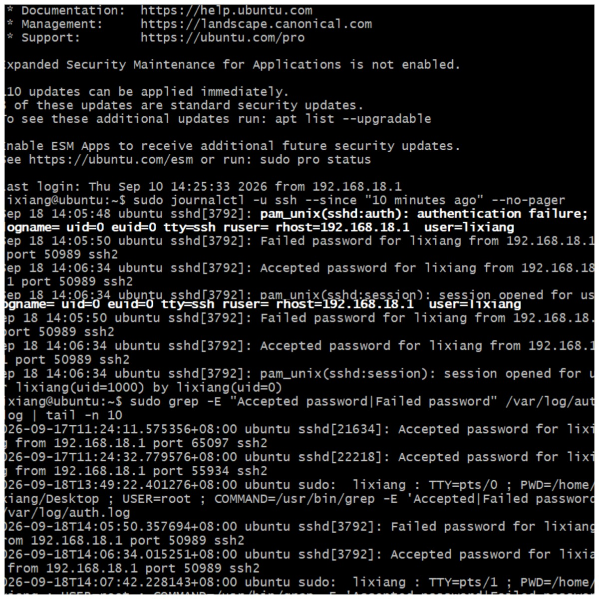
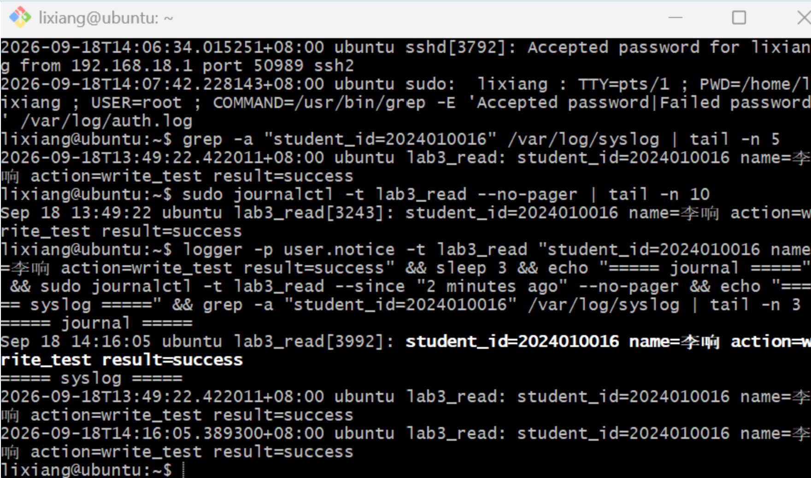

# Lab3：Linux 日志事件分析与对照

学号：2024010036　姓名：雷清程

---

## 三、生成并查询本次实验日志

### 3.1 产生成功、失败认证记录并查询

在 Ubuntu 终端执行：

```bash
whoami
hostname -I
hostname
```

> 记录：本次使用的 Ubuntu 用户名为 **lixiang**（与 Lab2 相同）。
> 记录：本次 SSH 连接的 Ubuntu 目标 IP 为 **192.168.18.128**（2026-09-18 实测确认）。
> 记录：本机主机名为 **ubuntu**（即 4W1R 中 Where 的取值）。

在 Windows 中重新打开一个 Git Bash 窗口，用上面的用户名和 IP 登录（出现密码提示时故意输错一次密码，看到 `Permission denied, please try again.` 后再输入正确密码完成登录）：

```bash
ssh -o PubkeyAuthentication=no lixiang@192.168.18.128
```

说明：本机已配置公钥免密登录（auth.log 中 9 月 17 日的成功记录均为 `Accepted publickey`），加 `-o PubkeyAuthentication=no` 可禁用公钥、强制使用密码认证，才能产生本次实验需要的密码认证成功与失败记录。

在已登录的 Ubuntu 会话中查询认证日志：

```bash
sudo journalctl -u ssh --since "15 minutes ago" --no-pager
```

```bash
sudo grep -E "Accepted password|Failed password" /var/log/auth.log | tail -n 20
```

**认证结果表**

| 认证事件 | 日志时间 | 尝试登录的账号 | 来源 IP | 结果关键词 | 日志来源 |
| :--- | :--- | :--- | :--- | :--- | :--- |
| 成功认证 | 9 月 18 日 14:06:34 | lixiang | 192.168.18.1 | Accepted password | journal（sshd[3792]），`sudo journalctl -u ssh` 查询输出 |
| 失败认证 | 9 月 18 日 14:05:50 | lixiang | 192.168.18.1 | Failed password | journal（sshd[3792]），`sudo journalctl -u ssh` 查询输出 |

说明：来源 IP 是 Ubuntu 看到的客户端地址（Windows/Git Bash 一侧），与 `hostname -I` 查到的 Ubuntu 目标 IP 不同，两者作用不同。



### 3.2 写入并追踪自己的日志

在已登录的 Ubuntu 会话中执行（实验中实际执行了两次：13:49:22 与 14:16:05，两处各保存了正文相同的记录；下表对照采用 14:16:05 那条）：

```bash
logger -p user.notice -t lab3_read "student_id=2024010016 name=李响 action=write_test result=success"
```

两处查询（只是读取，不会再次写入，两处应是同一次写入留下的同一条消息）：

```bash
sudo journalctl -t lab3_read --since "5 minutes ago" --no-pager
```

```bash
grep -a "student_id=2024010016" /var/log/syslog | tail -n 5
```

（注：直接 grep 提示 binary file matches，加 `-a` 强制按文本处理即可正常显示）

**两处查询结果对照**

| 项目 | 记录 |
| :--- | :--- |
| journal 中是否查到 | 是：`Sep 18 14:16:05 ubuntu lab3_read[3992]: student_id=2024010016 name=李响 action=write_test result=success`（另有一条 13:49:22 [3243]，正文相同） |
| /var/log/syslog 中是否查到 | 是：`2026-09-18T14:16:05.389300+08:00 ubuntu lab3_read: student_id=2024010016 name=李响 action=write_test result=success`（另有一条 13:49:22.422011，正文相同） |
| 两处记录有哪些共同字段或正文 | 同一标签 lab3_read、同一主机 ubuntu、时间一致（14:16:05），正文完全相同：student_id=2024010016 name=李响 action=write_test result=success |
| 两处输出的主要区别 | journal 用"Sep 18 14:16:05"短格式显示（不带年份、时区），并显示进程号 [3992]；syslog 用 ISO 格式，带年份、时区 +08:00 和毫秒，不显示进程号。两处显示格式和附带字段不同，但保存的是同一次写入的同一条消息 |



---

## 四、完成三份事件分析

### 4.1 一条自定义日志：`/var/log/syslog`

```text
获取命令：grep -a "student_id=2024010016" /var/log/syslog | tail -n 5
日志原文：2026-09-18T14:16:05.389300+08:00 ubuntu lab3_read: student_id=2024010016 name=李响 action=write_test result=success
```

| 4W1R | 根据本人原始日志填写 |
| :--- | :--- |
| When 什么时候 | 2026 年 9 月 18 日 14:16:05（+08:00 即北京时间；该日志自带年份和时区） |
| Where 在哪里 | 主机 ubuntu |
| Who 谁 | 自己指定的标签 lab3_read 写入（syslog 这行未显示进程号；journal 中同条记录显示进程号 3992）；正文标识本人李响，学号 2024010016 |
| What 做了什么 | 用 logger 向本机日志系统写入一条 write_test 测试消息 |
| Result 结果如何 | 正文写明 result=success，这是自己写入的测试标记，需结合两处查询均能查到来印证 |

**用一两句话解释这个事件：**

> 2026 年 9 月 18 日 14 时 16 分 05 秒，本人在 ubuntu 主机上用 logger 写入一条学号 2024010016、姓名李响的测试消息，正文标记结果为 success。/var/log/syslog 与 journal 中都能查到这条消息，正文相同但显示格式不同——syslog 用带年份、时区和毫秒的 ISO 时间且不显示进程号，journal 则相反，说明同一条消息被两套系统分别保存。

### 4.2 一条 SSH 认证记录：`/var/log/auth.log`

```text
获取命令：sudo grep -E "Accepted password|Failed password" /var/log/auth.log | tail -n 10
（注：只筛密码认证，过滤掉 publickey 免密记录）
日志原文：2026-09-18T14:05:50.357694+08:00 ubuntu sshd[3792]: Failed password for lixiang from 192.168.18.1 port 50989 ssh2
```

| 4W1R | 根据本人原始日志填写 |
| :--- | :--- |
| When 什么时候 | 2026 年 9 月 18 日 14:05:50（+08:00 即北京时间；该日志自带年份和时区） |
| Where 在哪里 | 主机 ubuntu |
| Who 谁 | 记录程序为 sshd（进程号 3792）；尝试登录的账号为 lixiang；来源 IP 为 192.168.18.1（客户端地址，即 Windows 一侧） |
| What 做了什么 | 尝试用密码登录 SSH |
| Result 结果如何 | 正文写明 Failed password，即这一次密码认证失败 |

**用一两句话解释这个事件：**

> 2026 年 9 月 18 日 14 时 05 分 50 秒，来自 192.168.18.1 的连接尝试用 lixiang 账号的密码登录 ubuntu 主机，这次密码认证失败，由 sshd 记录在 auth.log 中；这是实验中故意输错一次密码产生的记录。

### 4.3 一条软件包状态记录：`/var/log/dpkg.log`

先安装指定软件 htop：

```bash
sudo apt update
sudo apt install -y htop
```

查询 dpkg.log 中 htop 相关的状态记录，选取其中一条：

```bash
grep "htop" /var/log/dpkg.log | tail -n 10
```

```text
实际日志来源（使用替代来源时说明原因）：本人 Ubuntu 虚拟机的 /var/log/dpkg.log
获取命令：grep "htop" /var/log/dpkg.log | tail -n 10
日志原文：2026-09-18 13:49:39 status installed htop:amd64 3.3.0-4build1
```

| 4W1R | 根据本人原始日志填写 |
| :--- | :--- |
| When 什么时候 | 2026 年 9 月 18 日 13:49:39；该日志未提供时区 |
| Where 在哪里 | 该日志未提供主机名；记录取自本人 Ubuntu 虚拟机的 /var/log/dpkg.log |
| Who 谁 | 记录工具为 dpkg；该日志未提供执行操作的用户账号 |
| What 做了什么 | 记录 htop 软件包的状态 |
| Result 结果如何 | 状态为 installed，即已安装；仅凭这一行不能判断此前执行的是首次安装还是升级 |

**用一两句话解释这个事件：**

> 2026 年 9 月 18 日 13 时 49 分 39 秒，软件包管理工具 dpkg 记录了 htop 处于 installed（已安装）状态，这一行没有说明是哪位用户执行的操作；同一分钟内 dpkg.log 还依次记录了 install、half-installed、unpacked、half-configured 等中间状态，最终到达 installed。

---

## 五、知识问答

1. systemd-journald 与 rsyslog 各负责什么？结合 3.2 节的结果，解释它们为什么可以同时保留同一条日志。

> 填写：journald 负责把系统和程序产生的消息统一收进二进制 journal，用 journalctl 查询；rsyslog 负责把收到的消息按类别写成 /var/log/syslog、/var/log/auth.log 这类文本文件。消息先由 journald 接收，它再把一部分转发给 rsyslog，两边各存一份，所以同一条日志能同时查到。3.2 节我用 logger 写入的 lab3_read 消息在 journal 和 /var/log/syslog 里都能查到，正文相同、显示格式不同，说明是同一次写入被两套系统分别保存，而不是写入了两次。

2. SSH 提示 `Failed password` 能证明什么，不能证明什么？请结合本次记录回答。

> 填写：能证明这一次针对某账号、来自某来源 IP 的密码认证尝试失败了。不能证明是谁在操作、为什么失败、是否发生了入侵：本次实验中我自己故意输错一次密码也产生了一条 Failed password 记录，说明这类失败可能只是正常用户输错密码，单凭这一条记录不能判定为攻击行为。